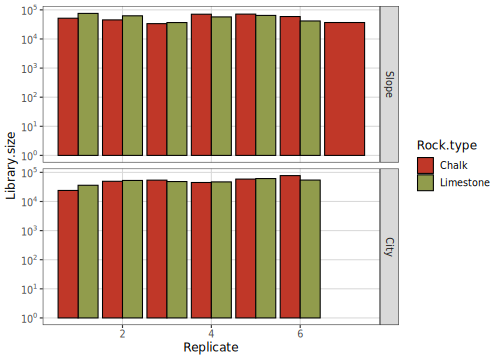
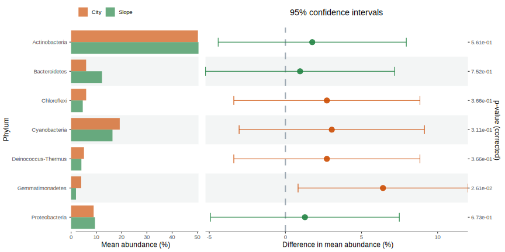
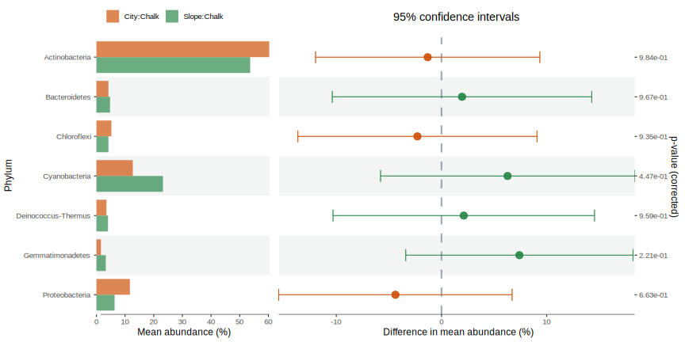
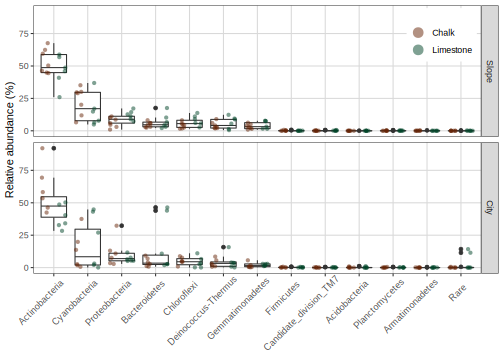
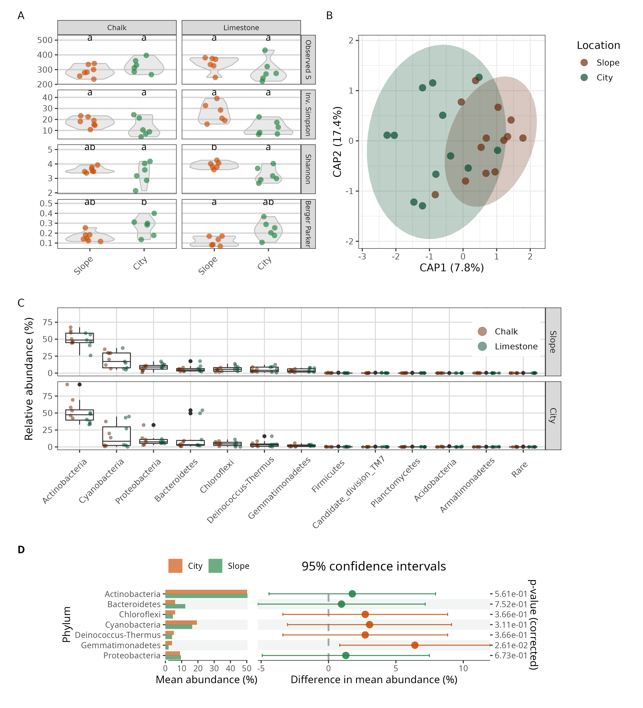

How fast does biological rock crust grow?
================
20 April, 2021

-   [Setting general parameters:](#setting-general-parameters)
-   [Description](#description)
    -   [Load data](#load-data)
    -   [Inspect library size and number of
        OTU](#inspect-library-size-and-number-of-otu)
    -   [Explore the prevalence of different taxa in the
        database](#explore-the-prevalence-of-different-taxa-in-the-database)
        -   [Plot general prevalence features of the
            phyla](#plot-general-prevalence-features-of-the-phyla)
        -   [Plot general prevalence features of the top 20
            orders](#plot-general-prevalence-features-of-the-top-20-orders)
        -   [Unsupervised filtering by
            prevalence](#unsupervised-filtering-by-prevalence)
    -   [Exploring the dataset
        features](#exploring-the-dataset-features)
    -   [Alpha diversity](#alpha-diversity)
        -   [Calculate and plot alpha diversity
            metrics](#calculate-and-plot-alpha-diversity-metrics)
        -   [Test the differences in alpha
            diversity.](#test-the-differences-in-alpha-diversity)
        -   [Plot all alpha diversity metrics
            together](#plot-all-alpha-diversity-metrics-together)
    -   [Beta diversity](#beta-diversity)
        -   [Calculate ordinations](#calculate-ordinations)
        -   [Test differences between samples on the phylum
            level](#test-differences-between-samples-on-the-phylum-level)
    -   [Taxonmic distribution
        analysis](#taxonmic-distribution-analysis)
    -   [Differential abundance models](#differential-abundance-models)
    -   [Compose figures](#compose-figures)
    -   [References](#references)

### Setting general parameters:

``` r
set.seed(15102020)
bootstraps <- 1000
data_path <- "./Data/"
Proj_name <- "BRC_growth_rate"

Browns <- RColorBrewer::brewer.pal(n = 9, "YlOrBr")[9:6]
Greens <- RColorBrewer::brewer.pal(n = 9, "YlGn")[9:6]
Blues <- RColorBrewer::brewer.pal(n = 9, "YlGnBu")[9:6]
Gradient.colours <- c(Browns[1], Greens[1], Browns[2], Greens[2], Browns[3], Greens[3], Browns[4], Greens[4], Blues)
```

## Description

This script reproduces all sequence analysis steps and plots included in
the paper plus some additional exploratory analyses.

### Load data

``` r
OTUmat <- t(read.csv(paste0(data_path, "Shivta_site_otuTab2.txt"), header = TRUE, row.names = 1))
sort.order <- as.numeric(gsub("OTU([0-9]+)", "\\1", colnames( OTUmat )))
OTUmat <- OTUmat[, order(sort.order )]

Metadata <- read.csv(paste0(data_path, "Shivta_metadata.csv"), row.names = 1, header = TRUE)

read_csv(paste0(data_path, "Shivta_metadata.csv"),
                     trim_ws = TRUE) %>%
  mutate_at(
    c(
      "Rock.type",
      "Location"
    ), 
    ~(factor(.))
  ) %>% 
  column_to_rownames("Sample.code") ->
  Metadata

row.names(OTUmat) <- gsub("(.*)Nimrod[0-9]+|Osnat[0-9]+", "\\1", row.names( OTUmat))
Metadata <- Metadata[order(row.names(Metadata)), ]
OTUmat <- OTUmat[order(row.names(OTUmat)), ]
# calculate sample size
Metadata$Library.size = rowSums(OTUmat)
Metadata$Location.rock <- with(Metadata, Location:Rock.type)

# Load taxonomy data
tax.file <- "Shivta_site_silva.nrv119.taxonomy"
Taxonomy <- read.table(paste0(data_path, tax.file), stringsAsFactors = FALSE) # read taxonomy file

# count how many ';' in each cell and add up to 6
for (i in 1:nrow(Taxonomy)){
  semicolons <- length(gregexpr(";", Taxonomy$V2[i] )[[1]])
  if (semicolons < 6){
    x <- paste0( rep("Unclassified;", 6 - semicolons ), collapse = "")
    Taxonomy$V2[i] <- paste0( Taxonomy$V2[i], x, sep = "")
  }
}
# split taxonomy to columns
do.call( "rbind", strsplit( Taxonomy$V1, ";", fixed = TRUE)) %>% 
  gsub( "size=([0-9]+)", "\\1", .) %>%
  data.frame( ., do.call( "rbind", strsplit( Taxonomy$V2, ";", fixed = TRUE)), stringsAsFactors = F) %>% 
  apply(., 2, function(x) gsub( "\\(.*\\)", "", x)) %>% 
  replace(., . == "unclassified", "Unclassified") -> 
  Taxonomy
colnames( Taxonomy ) <- c( "OTU", "Frequency", "Domain", "Phylum", "Class", "Order", "Family", "Genus" )
# rownames(Taxonomy) <- colnames(Rock_weathering_OTUmat)
rownames(Taxonomy) <- Taxonomy[, 1]

Tree_IQ <- read_tree(paste0(data_path, "Shivta_site_otuReps.filtered.align.treefile"))

# generate phyloseq object
Ps_obj <- phyloseq(otu_table(OTUmat, taxa_are_rows = FALSE),
                   tax_table(Taxonomy[, -c(1, 2)]),
                   sample_data(Metadata),
                   phy_tree(Tree_IQ)
)
# Reorder factors for plotting
sample_data(Ps_obj)$Location %<>% fct_relevel("Slope", "City")
```

Remove un- and mis-classified sequences, chloroplasts and mitochondria

``` r
domains2remove <- c("", "Archaea", "Eukaryota", "Unclassified")
classes2remove <- c("Chloroplast")
families2remove <- c("Mitochondria")
Ps_obj_filt <- subset_taxa(Ps_obj, !is.na(Phylum) &
                        !Domain %in% domains2remove &
                      !Class %in% classes2remove &
                      !Family %in% families2remove)
```

### Inspect library size and number of OTU

``` r
Ps_obj_df <-
  as.data.frame(sample_data(Ps_obj_filt)) # Put sample_data into a ggplot-friendly data.frame
Ps_obj_df <- Ps_obj_df[order(Ps_obj_df$Library.size), ]
Ps_obj_df$Index <- seq(nrow(Ps_obj_df))
ggplot(data = Ps_obj_df, 
       aes(x = Index, y = Library.size, color = Location.rock)) + 
  geom_point2(size = 4) + 
  scale_colour_manual(values = ggpomological:::pomological_palette[c(2, 1, 9, 3)], name = "Location.rock")
```

<!-- -->

``` r
summary(sample_sums(Ps_obj_filt))
```

    ##    Min. 1st Qu.  Median    Mean 3rd Qu.    Max. 
    ##   23966   44989   53000   52663   61348   77459

``` r
summary(taxa_sums(Ps_obj_filt))
```

    ##    Min. 1st Qu.  Median    Mean 3rd Qu.    Max. 
    ##       3      70     198    1852     771   76180

### Explore the prevalence of different taxa in the database

``` r
prevdf <- apply(X = otu_table(Ps_obj_filt),
                 MARGIN = ifelse(taxa_are_rows(Ps_obj_filt), yes = 1, no = 2),
                 FUN = function(x){sum(x > 0)})
# Add taxonomy and total read counts to this data.frame
prevdf <- data.frame(Prevalence = prevdf,
                      TotalAbundance = taxa_sums(Ps_obj_filt),
                      tax_table(Ps_obj_filt))
prevdf %>%
  group_by(Phylum) %>%
  summarise(`Mean prevalence` = mean(Prevalence),
            `Sum prevalence` = sum(Prevalence)) ->
  Prevalence_phylum_summary

Prevalence_phylum_summary %>% 
  kable(., digits = c(0, 1, 0)) %>%
  kable_styling(bootstrap_options = c("striped", "hover", "condensed", "responsive"), full_width = F)
```

<table class="table table-striped table-hover table-condensed table-responsive" style="width: auto !important; margin-left: auto; margin-right: auto;">
<thead>
<tr>
<th style="text-align:left;">
Phylum
</th>
<th style="text-align:right;">
Mean prevalence
</th>
<th style="text-align:right;">
Sum prevalence
</th>
</tr>
</thead>
<tbody>
<tr>
<td style="text-align:left;">
Acidobacteria
</td>
<td style="text-align:right;">
11.7
</td>
<td style="text-align:right;">
152
</td>
</tr>
<tr>
<td style="text-align:left;">
Actinobacteria
</td>
<td style="text-align:right;">
16.3
</td>
<td style="text-align:right;">
3414
</td>
</tr>
<tr>
<td style="text-align:left;">
Aquificae
</td>
<td style="text-align:right;">
4.0
</td>
<td style="text-align:right;">
12
</td>
</tr>
<tr>
<td style="text-align:left;">
Armatimonadetes
</td>
<td style="text-align:right;">
7.6
</td>
<td style="text-align:right;">
76
</td>
</tr>
<tr>
<td style="text-align:left;">
Bacteroidetes
</td>
<td style="text-align:right;">
11.8
</td>
<td style="text-align:right;">
1027
</td>
</tr>
<tr>
<td style="text-align:left;">
Candidate\_division\_KB1
</td>
<td style="text-align:right;">
8.0
</td>
<td style="text-align:right;">
8
</td>
</tr>
<tr>
<td style="text-align:left;">
Candidate\_division\_OD1
</td>
<td style="text-align:right;">
4.0
</td>
<td style="text-align:right;">
4
</td>
</tr>
<tr>
<td style="text-align:left;">
Candidate\_division\_OP11
</td>
<td style="text-align:right;">
4.5
</td>
<td style="text-align:right;">
9
</td>
</tr>
<tr>
<td style="text-align:left;">
Candidate\_division\_TM7
</td>
<td style="text-align:right;">
7.9
</td>
<td style="text-align:right;">
158
</td>
</tr>
<tr>
<td style="text-align:left;">
Chloroflexi
</td>
<td style="text-align:right;">
11.0
</td>
<td style="text-align:right;">
1124
</td>
</tr>
<tr>
<td style="text-align:left;">
Cyanobacteria
</td>
<td style="text-align:right;">
14.9
</td>
<td style="text-align:right;">
506
</td>
</tr>
<tr>
<td style="text-align:left;">
Deinococcus-Thermus
</td>
<td style="text-align:right;">
15.8
</td>
<td style="text-align:right;">
174
</td>
</tr>
<tr>
<td style="text-align:left;">
Firmicutes
</td>
<td style="text-align:right;">
13.4
</td>
<td style="text-align:right;">
214
</td>
</tr>
<tr>
<td style="text-align:left;">
Gemmatimonadetes
</td>
<td style="text-align:right;">
11.2
</td>
<td style="text-align:right;">
617
</td>
</tr>
<tr>
<td style="text-align:left;">
Nitrospirae
</td>
<td style="text-align:right;">
6.0
</td>
<td style="text-align:right;">
12
</td>
</tr>
<tr>
<td style="text-align:left;">
Planctomycetes
</td>
<td style="text-align:right;">
10.8
</td>
<td style="text-align:right;">
140
</td>
</tr>
<tr>
<td style="text-align:left;">
Proteobacteria
</td>
<td style="text-align:right;">
14.4
</td>
<td style="text-align:right;">
1817
</td>
</tr>
<tr>
<td style="text-align:left;">
Tenericutes
</td>
<td style="text-align:right;">
3.0
</td>
<td style="text-align:right;">
3
</td>
</tr>
<tr>
<td style="text-align:left;">
Verrucomicrobia
</td>
<td style="text-align:right;">
23.0
</td>
<td style="text-align:right;">
23
</td>
</tr>
<tr>
<td style="text-align:left;">
WCHB1-60
</td>
<td style="text-align:right;">
7.0
</td>
<td style="text-align:right;">
28
</td>
</tr>
</tbody>
</table>

``` r
prevdf %>%
  group_by(Order) %>%
  summarise(`Mean prevalence` = mean(Prevalence),
            `Sum prevalence` = sum(Prevalence)) ->
  Prevalence_Order_summary

Prevalence_Order_summary %>% 
  kable(., digits = c(0, 1, 0)) %>%
  kable_styling(bootstrap_options = c("striped", "hover", "condensed", "responsive"), full_width = F)
```

<table class="table table-striped table-hover table-condensed table-responsive" style="width: auto !important; margin-left: auto; margin-right: auto;">
<thead>
<tr>
<th style="text-align:left;">
Order
</th>
<th style="text-align:right;">
Mean prevalence
</th>
<th style="text-align:right;">
Sum prevalence
</th>
</tr>
</thead>
<tbody>
<tr>
<td style="text-align:left;">
AKIW781
</td>
<td style="text-align:right;">
9.4
</td>
<td style="text-align:right;">
198
</td>
</tr>
<tr>
<td style="text-align:left;">
AKYG1722
</td>
<td style="text-align:right;">
10.7
</td>
<td style="text-align:right;">
75
</td>
</tr>
<tr>
<td style="text-align:left;">
AT425-EubC11\_terrestrial\_group
</td>
<td style="text-align:right;">
10.2
</td>
<td style="text-align:right;">
378
</td>
</tr>
<tr>
<td style="text-align:left;">
Acidimicrobiales
</td>
<td style="text-align:right;">
14.7
</td>
<td style="text-align:right;">
368
</td>
</tr>
<tr>
<td style="text-align:left;">
Alteromonadales
</td>
<td style="text-align:right;">
12.0
</td>
<td style="text-align:right;">
12
</td>
</tr>
<tr>
<td style="text-align:left;">
Aquificales
</td>
<td style="text-align:right;">
4.0
</td>
<td style="text-align:right;">
12
</td>
</tr>
<tr>
<td style="text-align:left;">
Ardenticatenales
</td>
<td style="text-align:right;">
8.0
</td>
<td style="text-align:right;">
16
</td>
</tr>
<tr>
<td style="text-align:left;">
B103G10
</td>
<td style="text-align:right;">
7.0
</td>
<td style="text-align:right;">
7
</td>
</tr>
<tr>
<td style="text-align:left;">
BD2-11\_terrestrial\_group
</td>
<td style="text-align:right;">
5.0
</td>
<td style="text-align:right;">
5
</td>
</tr>
<tr>
<td style="text-align:left;">
Bacillales
</td>
<td style="text-align:right;">
13.7
</td>
<td style="text-align:right;">
164
</td>
</tr>
<tr>
<td style="text-align:left;">
Bacteroidales
</td>
<td style="text-align:right;">
17.0
</td>
<td style="text-align:right;">
17
</td>
</tr>
<tr>
<td style="text-align:left;">
Bdellovibrionales
</td>
<td style="text-align:right;">
8.0
</td>
<td style="text-align:right;">
40
</td>
</tr>
<tr>
<td style="text-align:left;">
Burkholderiales
</td>
<td style="text-align:right;">
18.5
</td>
<td style="text-align:right;">
204
</td>
</tr>
<tr>
<td style="text-align:left;">
C0119
</td>
<td style="text-align:right;">
5.0
</td>
<td style="text-align:right;">
5
</td>
</tr>
<tr>
<td style="text-align:left;">
Caldilineales
</td>
<td style="text-align:right;">
18.0
</td>
<td style="text-align:right;">
18
</td>
</tr>
<tr>
<td style="text-align:left;">
Campylobacterales
</td>
<td style="text-align:right;">
6.0
</td>
<td style="text-align:right;">
6
</td>
</tr>
<tr>
<td style="text-align:left;">
Caulobacterales
</td>
<td style="text-align:right;">
23.7
</td>
<td style="text-align:right;">
71
</td>
</tr>
<tr>
<td style="text-align:left;">
Chromatiales
</td>
<td style="text-align:right;">
20.0
</td>
<td style="text-align:right;">
20
</td>
</tr>
<tr>
<td style="text-align:left;">
Chthoniobacterales
</td>
<td style="text-align:right;">
23.0
</td>
<td style="text-align:right;">
23
</td>
</tr>
<tr>
<td style="text-align:left;">
Clostridiales
</td>
<td style="text-align:right;">
6.5
</td>
<td style="text-align:right;">
13
</td>
</tr>
<tr>
<td style="text-align:left;">
Corynebacteriales
</td>
<td style="text-align:right;">
8.0
</td>
<td style="text-align:right;">
40
</td>
</tr>
<tr>
<td style="text-align:left;">
Cytophagales
</td>
<td style="text-align:right;">
11.8
</td>
<td style="text-align:right;">
695
</td>
</tr>
<tr>
<td style="text-align:left;">
Deinococcales
</td>
<td style="text-align:right;">
15.1
</td>
<td style="text-align:right;">
151
</td>
</tr>
<tr>
<td style="text-align:left;">
Desulfovibrionales
</td>
<td style="text-align:right;">
5.0
</td>
<td style="text-align:right;">
5
</td>
</tr>
<tr>
<td style="text-align:left;">
E6aD10
</td>
<td style="text-align:right;">
11.0
</td>
<td style="text-align:right;">
11
</td>
</tr>
<tr>
<td style="text-align:left;">
EMP-G18
</td>
<td style="text-align:right;">
3.0
</td>
<td style="text-align:right;">
3
</td>
</tr>
<tr>
<td style="text-align:left;">
Enterobacteriales
</td>
<td style="text-align:right;">
22.0
</td>
<td style="text-align:right;">
44
</td>
</tr>
<tr>
<td style="text-align:left;">
Euzebyales
</td>
<td style="text-align:right;">
13.5
</td>
<td style="text-align:right;">
202
</td>
</tr>
<tr>
<td style="text-align:left;">
Flavobacteriales
</td>
<td style="text-align:right;">
12.7
</td>
<td style="text-align:right;">
38
</td>
</tr>
<tr>
<td style="text-align:left;">
Frankiales
</td>
<td style="text-align:right;">
20.9
</td>
<td style="text-align:right;">
356
</td>
</tr>
<tr>
<td style="text-align:left;">
Gaiellales
</td>
<td style="text-align:right;">
10.4
</td>
<td style="text-align:right;">
94
</td>
</tr>
<tr>
<td style="text-align:left;">
Gemmatimonadales
</td>
<td style="text-align:right;">
14.3
</td>
<td style="text-align:right;">
214
</td>
</tr>
<tr>
<td style="text-align:left;">
JG30-KF-CM45
</td>
<td style="text-align:right;">
13.0
</td>
<td style="text-align:right;">
468
</td>
</tr>
<tr>
<td style="text-align:left;">
Kineosporiales
</td>
<td style="text-align:right;">
20.2
</td>
<td style="text-align:right;">
121
</td>
</tr>
<tr>
<td style="text-align:left;">
Lactobacillales
</td>
<td style="text-align:right;">
18.5
</td>
<td style="text-align:right;">
37
</td>
</tr>
<tr>
<td style="text-align:left;">
Micrococcales
</td>
<td style="text-align:right;">
18.0
</td>
<td style="text-align:right;">
198
</td>
</tr>
<tr>
<td style="text-align:left;">
Micromonosporales
</td>
<td style="text-align:right;">
19.5
</td>
<td style="text-align:right;">
39
</td>
</tr>
<tr>
<td style="text-align:left;">
Myxococcales
</td>
<td style="text-align:right;">
10.2
</td>
<td style="text-align:right;">
51
</td>
</tr>
<tr>
<td style="text-align:left;">
Nitriliruptorales
</td>
<td style="text-align:right;">
9.7
</td>
<td style="text-align:right;">
58
</td>
</tr>
<tr>
<td style="text-align:left;">
Nitrosomonadales
</td>
<td style="text-align:right;">
11.5
</td>
<td style="text-align:right;">
23
</td>
</tr>
<tr>
<td style="text-align:left;">
Nitrospirales
</td>
<td style="text-align:right;">
6.0
</td>
<td style="text-align:right;">
12
</td>
</tr>
<tr>
<td style="text-align:left;">
Oceanospirillales
</td>
<td style="text-align:right;">
16.0
</td>
<td style="text-align:right;">
16
</td>
</tr>
<tr>
<td style="text-align:left;">
Orbales
</td>
<td style="text-align:right;">
7.0
</td>
<td style="text-align:right;">
7
</td>
</tr>
<tr>
<td style="text-align:left;">
Order\_II
</td>
<td style="text-align:right;">
4.8
</td>
<td style="text-align:right;">
24
</td>
</tr>
<tr>
<td style="text-align:left;">
Order\_III
</td>
<td style="text-align:right;">
8.7
</td>
<td style="text-align:right;">
26
</td>
</tr>
<tr>
<td style="text-align:left;">
PAUC43f\_marine\_benthic\_group
</td>
<td style="text-align:right;">
2.0
</td>
<td style="text-align:right;">
2
</td>
</tr>
<tr>
<td style="text-align:left;">
Planctomycetales
</td>
<td style="text-align:right;">
9.2
</td>
<td style="text-align:right;">
74
</td>
</tr>
<tr>
<td style="text-align:left;">
Propionibacteriales
</td>
<td style="text-align:right;">
14.5
</td>
<td style="text-align:right;">
318
</td>
</tr>
<tr>
<td style="text-align:left;">
Pseudomonadales
</td>
<td style="text-align:right;">
14.7
</td>
<td style="text-align:right;">
103
</td>
</tr>
<tr>
<td style="text-align:left;">
Pseudonocardiales
</td>
<td style="text-align:right;">
18.0
</td>
<td style="text-align:right;">
306
</td>
</tr>
<tr>
<td style="text-align:left;">
Rhizobiales
</td>
<td style="text-align:right;">
16.1
</td>
<td style="text-align:right;">
386
</td>
</tr>
<tr>
<td style="text-align:left;">
Rhodobacterales
</td>
<td style="text-align:right;">
14.8
</td>
<td style="text-align:right;">
163
</td>
</tr>
<tr>
<td style="text-align:left;">
Rhodospirillales
</td>
<td style="text-align:right;">
11.8
</td>
<td style="text-align:right;">
271
</td>
</tr>
<tr>
<td style="text-align:left;">
Rickettsiales
</td>
<td style="text-align:right;">
11.2
</td>
<td style="text-align:right;">
146
</td>
</tr>
<tr>
<td style="text-align:left;">
Rubrobacterales
</td>
<td style="text-align:right;">
22.3
</td>
<td style="text-align:right;">
491
</td>
</tr>
<tr>
<td style="text-align:left;">
S0134\_terrestrial\_group
</td>
<td style="text-align:right;">
18.0
</td>
<td style="text-align:right;">
18
</td>
</tr>
<tr>
<td style="text-align:left;">
SBYG-4553
</td>
<td style="text-align:right;">
10.0
</td>
<td style="text-align:right;">
10
</td>
</tr>
<tr>
<td style="text-align:left;">
Solirubrobacterales
</td>
<td style="text-align:right;">
17.2
</td>
<td style="text-align:right;">
638
</td>
</tr>
<tr>
<td style="text-align:left;">
Sphaerobacterales
</td>
<td style="text-align:right;">
3.3
</td>
<td style="text-align:right;">
10
</td>
</tr>
<tr>
<td style="text-align:left;">
Sphingobacteriales
</td>
<td style="text-align:right;">
14.2
</td>
<td style="text-align:right;">
227
</td>
</tr>
<tr>
<td style="text-align:left;">
Sphingomonadales
</td>
<td style="text-align:right;">
19.6
</td>
<td style="text-align:right;">
196
</td>
</tr>
<tr>
<td style="text-align:left;">
Streptomycetales
</td>
<td style="text-align:right;">
24.5
</td>
<td style="text-align:right;">
49
</td>
</tr>
<tr>
<td style="text-align:left;">
Streptosporangiales
</td>
<td style="text-align:right;">
3.0
</td>
<td style="text-align:right;">
3
</td>
</tr>
<tr>
<td style="text-align:left;">
Subgroup\_3
</td>
<td style="text-align:right;">
15.0
</td>
<td style="text-align:right;">
15
</td>
</tr>
<tr>
<td style="text-align:left;">
Subgroup\_4
</td>
<td style="text-align:right;">
10.6
</td>
<td style="text-align:right;">
85
</td>
</tr>
<tr>
<td style="text-align:left;">
Subgroup\_6
</td>
<td style="text-align:right;">
13.0
</td>
<td style="text-align:right;">
52
</td>
</tr>
<tr>
<td style="text-align:left;">
SubsectionI
</td>
<td style="text-align:right;">
13.0
</td>
<td style="text-align:right;">
13
</td>
</tr>
<tr>
<td style="text-align:left;">
SubsectionII
</td>
<td style="text-align:right;">
15.8
</td>
<td style="text-align:right;">
315
</td>
</tr>
<tr>
<td style="text-align:left;">
SubsectionIII
</td>
<td style="text-align:right;">
14.8
</td>
<td style="text-align:right;">
118
</td>
</tr>
<tr>
<td style="text-align:left;">
SubsectionIV
</td>
<td style="text-align:right;">
13.5
</td>
<td style="text-align:right;">
54
</td>
</tr>
<tr>
<td style="text-align:left;">
TRA3-20
</td>
<td style="text-align:right;">
14.0
</td>
<td style="text-align:right;">
14
</td>
</tr>
<tr>
<td style="text-align:left;">
Thermales
</td>
<td style="text-align:right;">
23.0
</td>
<td style="text-align:right;">
23
</td>
</tr>
<tr>
<td style="text-align:left;">
Thermophilales
</td>
<td style="text-align:right;">
15.0
</td>
<td style="text-align:right;">
30
</td>
</tr>
<tr>
<td style="text-align:left;">
Unclassified
</td>
<td style="text-align:right;">
9.2
</td>
<td style="text-align:right;">
642
</td>
</tr>
<tr>
<td style="text-align:left;">
Unknown\_Order
</td>
<td style="text-align:right;">
9.8
</td>
<td style="text-align:right;">
98
</td>
</tr>
<tr>
<td style="text-align:left;">
Vampirovibrionales
</td>
<td style="text-align:right;">
6.0
</td>
<td style="text-align:right;">
6
</td>
</tr>
<tr>
<td style="text-align:left;">
WD2101\_soil\_group
</td>
<td style="text-align:right;">
13.0
</td>
<td style="text-align:right;">
39
</td>
</tr>
<tr>
<td style="text-align:left;">
Xanthomonadales
</td>
<td style="text-align:right;">
18.0
</td>
<td style="text-align:right;">
18
</td>
</tr>
</tbody>
</table>

Based on that we will remove all phyla with a prevalence of under 8

``` r
Prevalence_phylum_summary %>% 
  filter(`Sum prevalence` < 8) %>% 
  dplyr::select(Phylum) %>% 
  map(as.character) %>% 
  unlist() ->
  filterPhyla
Ps_obj_filt %<>% subset_taxa(!Phylum %in% filterPhyla)
sample_data(Ps_obj_filt)$Library.size <- rowSums(otu_table(Ps_obj_filt))
print(Ps_obj)
```

    ## phyloseq-class experiment-level object
    ## otu_table()   OTU Table:         [ 767 taxa and 25 samples ]
    ## sample_data() Sample Data:       [ 25 samples by 6 sample variables ]
    ## tax_table()   Taxonomy Table:    [ 767 taxa by 6 taxonomic ranks ]
    ## phy_tree()    Phylogenetic Tree: [ 767 tips and 765 internal nodes ]
    ## taxa are columns

``` r
print(Ps_obj_filt)
```

    ## phyloseq-class experiment-level object
    ## otu_table()   OTU Table:         [ 709 taxa and 25 samples ]
    ## sample_data() Sample Data:       [ 25 samples by 6 sample variables ]
    ## tax_table()   Taxonomy Table:    [ 709 taxa by 6 taxonomic ranks ]
    ## phy_tree()    Phylogenetic Tree: [ 709 tips and 707 internal nodes ]
    ## taxa are columns

#### Plot general prevalence features of the phyla

``` r
# Subset to the remaining phyla
prevdf_phylum_filt <- subset(prevdf, Phylum %in% get_taxa_unique(Ps_obj_filt, "Phylum"))
ggplot(prevdf_phylum_filt,
       aes(TotalAbundance, Prevalence / nsamples(Ps_obj_filt), color = Phylum)) +
  # Include a guess for parameter
  geom_hline(yintercept = 0.05,
             alpha = 0.5,
             linetype = 2) + geom_point2(size = 2, alpha = 0.7) +
  scale_x_log10() +  xlab("Total Abundance") + ylab("Prevalence [Frac. Samples]") +
  facet_wrap( ~ Phylum) + theme(legend.position = "none")
```

<!-- -->

#### Plot general prevalence features of the top 20 orders

``` r
# Subset to the remaining phyla
prevdf_order_filt <- subset(prevdf, Order %in% get_taxa_unique(Ps_obj_filt, "Order"))
# grab the top 30 most abundant orders
prevdf_order_filt %>% 
  group_by(Order) %>%
  summarise(Combined.abundance = sum(TotalAbundance)) %>% 
  arrange(desc(Combined.abundance)) %>% 
  .[1:30, "Order"]  ->
  Orders2plot
prevdf_order_filt2 <- subset(prevdf, Order %in% Orders2plot$Order)
ggplot(prevdf_order_filt2,
       aes(TotalAbundance, Prevalence / nsamples(Ps_obj_filt), color = Order)) +
  # Include a guess for parameter
  geom_hline(yintercept = 0.05,
             alpha = 0.5,
             linetype = 2) + geom_point2(size = 2, alpha = 0.7) +
  scale_x_log10() +  xlab("Total Abundance") + ylab("Prevalence [Frac. Samples]") +
  facet_wrap( ~ Order) + theme(legend.position = "none")
```

<!-- -->

#### Unsupervised filtering by prevalence

We will remove all sequences which appear in less than 10% of the
samples

``` r
# Define prevalence threshold as 10% of total samples
prevalenceThreshold <- 0.1 * nsamples(Ps_obj_filt)
prevalenceThreshold
```

    ## [1] 2.5

``` r
# Execute prevalence filter, using `prune_taxa()` function
keepTaxa <-
  row.names(prevdf_phylum_filt)[(prevdf_phylum_filt$Prevalence >= prevalenceThreshold)]
Ps_obj_filt  %<>%  prune_taxa(keepTaxa, .)
sample_data(Ps_obj_filt)$Library.size <- rowSums(otu_table(Ps_obj_filt))
print(Ps_obj)
```

    ## phyloseq-class experiment-level object
    ## otu_table()   OTU Table:         [ 767 taxa and 25 samples ]
    ## sample_data() Sample Data:       [ 25 samples by 6 sample variables ]
    ## tax_table()   Taxonomy Table:    [ 767 taxa by 6 taxonomic ranks ]
    ## phy_tree()    Phylogenetic Tree: [ 767 tips and 765 internal nodes ]
    ## taxa are columns

``` r
print(Ps_obj_filt)
```

    ## phyloseq-class experiment-level object
    ## otu_table()   OTU Table:         [ 694 taxa and 25 samples ]
    ## sample_data() Sample Data:       [ 25 samples by 6 sample variables ]
    ## tax_table()   Taxonomy Table:    [ 694 taxa by 6 taxonomic ranks ]
    ## phy_tree()    Phylogenetic Tree: [ 694 tips and 692 internal nodes ]
    ## taxa are columns

This removed 73 or 10% of the sequences.

### Exploring the dataset features

First let’s look at the count data distribution after filtering:

``` r
PlotLibDist(Ps_obj_filt)
```

<!-- -->

``` r
sample_data(Ps_obj_filt) %>% 
  as_tibble() %>% 
  dplyr::select(Sample.name, Library.size) %>% 
  as(., "data.frame") %>% 
  kable(.) %>%
  kable_styling(bootstrap_options = c("striped", "hover", "condensed", "responsive"), full_width = F)
```

<table class="table table-striped table-hover table-condensed table-responsive" style="width: auto !important; margin-left: auto; margin-right: auto;">
<thead>
<tr>
<th style="text-align:left;">
Sample.name
</th>
<th style="text-align:right;">
Library.size
</th>
</tr>
</thead>
<tbody>
<tr>
<td style="text-align:left;">
City Chalk 2
</td>
<td style="text-align:right;">
49453
</td>
</tr>
<tr>
<td style="text-align:left;">
City Chalk 3
</td>
<td style="text-align:right;">
54155
</td>
</tr>
<tr>
<td style="text-align:left;">
City Chalk 4
</td>
<td style="text-align:right;">
44943
</td>
</tr>
<tr>
<td style="text-align:left;">
City Chalk 5
</td>
<td style="text-align:right;">
58835
</td>
</tr>
<tr>
<td style="text-align:left;">
City Chalk 6
</td>
<td style="text-align:right;">
77459
</td>
</tr>
<tr>
<td style="text-align:left;">
City Limestone 1
</td>
<td style="text-align:right;">
36122
</td>
</tr>
<tr>
<td style="text-align:left;">
City Limestone 2
</td>
<td style="text-align:right;">
52816
</td>
</tr>
<tr>
<td style="text-align:left;">
City Limestone 3
</td>
<td style="text-align:right;">
48378
</td>
</tr>
<tr>
<td style="text-align:left;">
City Limestone 4
</td>
<td style="text-align:right;">
47108
</td>
</tr>
<tr>
<td style="text-align:left;">
City Limestone 5
</td>
<td style="text-align:right;">
61346
</td>
</tr>
<tr>
<td style="text-align:left;">
City Limestone 6
</td>
<td style="text-align:right;">
54505
</td>
</tr>
<tr>
<td style="text-align:left;">
Slope Limestone 1
</td>
<td style="text-align:right;">
75578
</td>
</tr>
<tr>
<td style="text-align:left;">
Slope Chalk 1
</td>
<td style="text-align:right;">
51651
</td>
</tr>
<tr>
<td style="text-align:left;">
Slope Chalk 2
</td>
<td style="text-align:right;">
45197
</td>
</tr>
<tr>
<td style="text-align:left;">
Slope Chalk 3
</td>
<td style="text-align:right;">
33625
</td>
</tr>
<tr>
<td style="text-align:left;">
Slope Chalk 4
</td>
<td style="text-align:right;">
70886
</td>
</tr>
<tr>
<td style="text-align:left;">
Slope Chalk 5
</td>
<td style="text-align:right;">
71458
</td>
</tr>
<tr>
<td style="text-align:left;">
Slope Chalk 6
</td>
<td style="text-align:right;">
58959
</td>
</tr>
<tr>
<td style="text-align:left;">
Slope Chalk 7
</td>
<td style="text-align:right;">
36756
</td>
</tr>
<tr>
<td style="text-align:left;">
City Chalk 1
</td>
<td style="text-align:right;">
23962
</td>
</tr>
<tr>
<td style="text-align:left;">
Slope Limestone 2
</td>
<td style="text-align:right;">
62456
</td>
</tr>
<tr>
<td style="text-align:left;">
Slope Limestone 3
</td>
<td style="text-align:right;">
36628
</td>
</tr>
<tr>
<td style="text-align:left;">
Slope Limestone 4
</td>
<td style="text-align:right;">
57283
</td>
</tr>
<tr>
<td style="text-align:left;">
Slope Limestone 5
</td>
<td style="text-align:right;">
64509
</td>
</tr>
<tr>
<td style="text-align:left;">
Slope Limestone 6
</td>
<td style="text-align:right;">
41564
</td>
</tr>
</tbody>
</table>

The figure and table indicate only a small deviation in the number of
reads per samples.

``` r
(mod1 <- adonis(
  otu_table(Ps_obj_filt) ~ Library.size,
  data = as(sample_data(Ps_obj_filt), "data.frame"), 
  method = "horn",
  permutations = 9999
))
```

    ## 
    ## Call:
    ## adonis(formula = otu_table(Ps_obj_filt) ~ Library.size, data = as(sample_data(Ps_obj_filt),      "data.frame"), permutations = 9999, method = "horn") 
    ## 
    ## Permutation: free
    ## Number of permutations: 9999
    ## 
    ## Terms added sequentially (first to last)
    ## 
    ##              Df SumsOfSqs MeanSqs F.Model      R2 Pr(>F)
    ## Library.size  1    0.4246 0.42456  1.3337 0.05481 0.2192
    ## Residuals    23    7.3218 0.31834         0.94519       
    ## Total        24    7.7464                 1.00000

``` r
PlotReadHist(as(otu_table(Ps_obj_filt), "matrix"))
```

<!-- -->

``` r
notAllZero <- (rowSums(t(otu_table(Ps_obj_filt))) > 0)
vsn::meanSdPlot(as.matrix(log2(t(otu_table(Ps_obj_filt))[notAllZero, ] + 1)))
```

<!-- -->

The difference in library sizes is low and its effect on the community
composition is minimal. We’ll use the GMPR method for library size
normalisation ([Chen and Chen 2017](#ref-chen_gmpr:_2017))

``` r
Ps_obj_filt_GMPR <- Ps_obj_filt
Ps_obj_filt %>%
  otu_table(.) %>%
  t() %>%
  as(., "matrix") %>%
  GMPR() ->
  GMPR_factors
```

    ## Begin GMPR size factor calculation ...
    ## Completed!
    ## Please watch for the samples with limited sharing with other samples based on NSS! They may be outliers!

``` r
Ps_obj_filt %>%
  otu_table(.) %>%
  t() %*% diag(1 / GMPR_factors$gmpr) %>%
  t() %>%
  as.data.frame(., row.names = sample_names(Ps_obj_filt)) %>%
  otu_table(., taxa_are_rows = FALSE) ->
  otu_table(Ps_obj_filt_GMPR)
sample_data(Ps_obj_filt_GMPR)$Library.size <- sample_sums(Ps_obj_filt)
adonis(
  otu_table(Ps_obj_filt_GMPR) ~ Library.size,
  data = as(sample_data(Ps_obj_filt_GMPR), "data.frame"),
  method = "horn",
  permutations = 9999
)
```

    ## 
    ## Call:
    ## adonis(formula = otu_table(Ps_obj_filt_GMPR) ~ Library.size,      data = as(sample_data(Ps_obj_filt_GMPR), "data.frame"), permutations = 9999,      method = "horn") 
    ## 
    ## Permutation: free
    ## Number of permutations: 9999
    ## 
    ## Terms added sequentially (first to last)
    ## 
    ##              Df SumsOfSqs MeanSqs F.Model      R2 Pr(>F)
    ## Library.size  1    0.4246 0.42456  1.3337 0.05481  0.228
    ## Residuals    23    7.3218 0.31834         0.94519       
    ## Total        24    7.7464                 1.00000

``` r
PlotLibDist(Ps_obj_filt_GMPR)
```

<!-- -->

Did it improve anything?

``` r
PlotReadHist(as(otu_table(Ps_obj_filt_GMPR), "matrix"))
```

<!-- -->

``` r
notAllZero <- (rowSums(t(otu_table(Ps_obj_filt_GMPR))) > 0)
vsn::meanSdPlot(as.matrix(log2(t(otu_table(Ps_obj_filt_GMPR))[notAllZero, ] + 1)))
```

<!-- -->

### Alpha diversity

#### Calculate and plot alpha diversity metrics

We do that by simulating 1000 rarefaction events and calculating the
metrics each time. Then, the result is averaged.

``` r
rarefaction.mat <- matrix(0, nrow = nsamples(Ps_obj_filt), ncol = bootstraps)
rownames(rarefaction.mat) <- sample_names(Ps_obj_filt)
rich.ests <- list(S.obs = rarefaction.mat, S.chao1 = rarefaction.mat, se.chao1 = rarefaction.mat,
                   S.ACE = rarefaction.mat, se.ACE = rarefaction.mat)
for (i in seq(bootstraps)) {
  sub.OTUmat <- rrarefy(otu_table(Ps_obj_filt), min(rowSums(otu_table(Ps_obj_filt))))
  for (j in seq(length(rich.ests))) {
    rich.ests[[j]][, i] <- t(estimateR(sub.OTUmat))[, j]
  }
}
Richness <- data.frame(row.names = row.names(rich.ests[[1]]))
for (i in c(1, seq(2, length(rich.ests), 2))) {
  S <- apply(rich.ests[[i]], 1, mean)
  if (i == 1) { 
    se <- apply(rich.ests[[i]], 1, function(x) (mean(x)/sqrt(length(x))))
    } else se <- apply(rich.ests[[i + 1]], 1, mean)
  Richness <- cbind(Richness, S, se)
}
colnames(Richness) <- c("S.obs", "S.obs.se", "S.chao1", "S.chao1.se", "S.ACE", "S.ACE.se")
saveRDS(Richness, file = paste0("./Results/", Proj_name, "_richness.RDS"))
write.csv(Richness, file = paste0("./Results/", Proj_name, "_richness.csv"))
ses <- grep("\\.se", colnames(Richness))
Richness[, ses] %>% 
  gather(key = "est.se") -> se.dat
Richness[, -unique(ses)] %>% 
  gather(key = "est") -> mean.dat
n <- length(unique(mean.dat$est))
# diversity indices
diversity.inds <- list(Shannon = rarefaction.mat, inv.simpson = rarefaction.mat, BP = rarefaction.mat)
for (i in seq(bootstraps)) {
  sub.OTUmat <- rrarefy(otu_table(Ps_obj_filt), min(rowSums(otu_table(Ps_obj_filt))))
  diversity.inds$Shannon[, i] <- diversityresult(sub.OTUmat, index = 'Shannon', method = 'each site', digits = 3)[, 1]
  diversity.inds$inv.simpson[, i] <- diversityresult(sub.OTUmat, index = 'inverseSimpson', method = 'each site', digits = 3)[, 1]
  diversity.inds$BP[, i] <- diversityresult(sub.OTUmat, index = 'Berger', method = 'each site', digits = 3)[, 1]
}
Diversity <- data.frame(row.names = row.names(diversity.inds[[1]]))
for (i in seq(length(diversity.inds))) {
  S <- apply(diversity.inds[[i]], 1, mean)
  se <- apply(diversity.inds[[i]], 1, function(x) (mean(x)/sqrt(length(x))))
  Diversity <- cbind(Diversity, S, se)
}
colnames(Diversity) <- c("Shannon", "Shannon.se", "Inv.simpson", "Inv.simpson.se", "BP", "BP.se")
ses <- grep("\\.se", colnames(Diversity))
Diversity[, ses] %>% gather(key = "est.se") -> se.dat
Diversity[, -unique(ses)] %>% gather(key = "est") -> mean.dat
saveRDS(Diversity, file = paste0("./Results/", Proj_name, "_diversity.RDS"))
write.csv(Diversity, file = paste0("./Results/", Proj_name, "_diversity.csv"))
```

#### Test the differences in alpha diversity.

``` r
# make combined richness diversity
Richness_Diversity <- cbind(Richness, Diversity)
ses <- grep("\\.se", colnames(Richness_Diversity))
Richness_Diversity[, ses] %>% 
  gather(key = "est.se") -> 
  se.dat
Richness_Diversity[, -unique(ses)] %>% 
  gather(key = "Metric", 
         value = "Estimate") -> 
  mean.dat
Richness_Diversity_long <-
  cbind(
    Sample = rep(rownames(Richness_Diversity), times = length(unique(mean.dat$Metric))),
    mean.dat,
    lerr = mean.dat$Estimate - se.dat$value,
    herr = mean.dat$Estimate + se.dat$value
  )
Richness_Diversity_long$Metric <-
  factor(
    Richness_Diversity_long$Metric,
    levels = c("S.obs", "S.chao1", "S.ACE", "Shannon", "Inv.simpson", "BP"),
    labels = c("S obs.", "Chao1", "ACE", "Shannon", "Inv. Simpson" , "Berger Parker")
  )
Richness_Diversity_long %<>%
  cbind(., 
        sample_data(Ps_obj_filt))

# S Obs
(mod_obsS <- TestAlphaV3(filter(Richness_Diversity_long, Metric == "S obs.")))
```

    ## Call:
    ##    aov(formula = as.formula(paste(response_name, paste(factor_names[1], 
    ##     factor_names[2], sep = " * "), sep = " ~ ")), data = data2test)
    ## 
    ## Terms:
    ##                 Location Rock.type Location:Rock.type Residuals
    ## Sum of Squares     67.75    647.17           10123.07  62200.46
    ## Deg. of Freedom        1         1                  1        21
    ## 
    ## Residual standard error: 54.42358
    ## Estimated effects may be unbalanced

<!-- -->

    ## [1] "Unequal group sizes - showing SS type III"
    ## Anova Table (Type III tests)
    ## 
    ## Response: Estimate
    ##                    Sum Sq Df  F value    Pr(>F)    
    ## (Intercept)        588166  1 198.5755 3.566e-12 ***
    ## Location             3993  1   1.3480   0.25866    
    ## Rock.type            7767  1   2.6224   0.12028    
    ## Location:Rock.type  10123  1   3.4177   0.07863 .  
    ## Residuals           62200 21                       
    ## ---
    ## Signif. codes:  0 '***' 0.001 '**' 0.01 '*' 0.05 '.' 0.1 ' ' 1
    ## Tables of means
    ## Grand mean
    ##          
    ## 310.9173 
    ## 
    ##  Location 
    ##     Slope City
    ##       312  309
    ## rep    13   12
    ## 
    ##  Rock.type 
    ##     Chalk Limestone
    ##       306       316
    ## rep    13        12
    ## 
    ##  Location:Rock.type 
    ##         Rock.type
    ## Location Chalk Limestone
    ##    Slope 290   339      
    ##    rep     7     6      
    ##    City  325   293      
    ##    rep     6     6

    ## Call:
    ##    aov(formula = as.formula(paste(response_name, paste(factor_names[1], 
    ##     factor_names[2], sep = " * "), sep = " ~ ")), data = data2test)
    ## 
    ## Terms:
    ##                 Location Rock.type Location:Rock.type Residuals
    ## Sum of Squares     67.75    647.17           10123.07  62200.46
    ## Deg. of Freedom        1         1                  1        21
    ## 
    ## Residual standard error: 54.42358
    ## Estimated effects may be unbalanced

``` r
# Post-hoc test
marginal <- emmeans(mod_obsS,
                   ~ Location : Rock.type)
summary(marginal)
```

<div class="kable-table">

<table>
<thead>
<tr>
<th style="text-align:left;">
Location
</th>
<th style="text-align:left;">
Rock.type
</th>
<th style="text-align:right;">
emmean
</th>
<th style="text-align:right;">
SE
</th>
<th style="text-align:right;">
df
</th>
<th style="text-align:right;">
lower.CL
</th>
<th style="text-align:right;">
upper.CL
</th>
</tr>
</thead>
<tbody>
<tr>
<td style="text-align:left;">
Slope
</td>
<td style="text-align:left;">
Chalk
</td>
<td style="text-align:right;">
289.8684
</td>
<td style="text-align:right;">
20.57018
</td>
<td style="text-align:right;">
21
</td>
<td style="text-align:right;">
247.0904
</td>
<td style="text-align:right;">
332.6465
</td>
</tr>
<tr>
<td style="text-align:left;">
City
</td>
<td style="text-align:left;">
Chalk
</td>
<td style="text-align:right;">
325.0227
</td>
<td style="text-align:right;">
22.21834
</td>
<td style="text-align:right;">
21
</td>
<td style="text-align:right;">
278.8171
</td>
<td style="text-align:right;">
371.2282
</td>
</tr>
<tr>
<td style="text-align:left;">
Slope
</td>
<td style="text-align:left;">
Limestone
</td>
<td style="text-align:right;">
338.9012
</td>
<td style="text-align:right;">
22.21834
</td>
<td style="text-align:right;">
21
</td>
<td style="text-align:right;">
292.6956
</td>
<td style="text-align:right;">
385.1067
</td>
</tr>
<tr>
<td style="text-align:left;">
City
</td>
<td style="text-align:left;">
Limestone
</td>
<td style="text-align:right;">
293.3852
</td>
<td style="text-align:right;">
22.21834
</td>
<td style="text-align:right;">
21
</td>
<td style="text-align:right;">
247.1796
</td>
<td style="text-align:right;">
339.5907
</td>
</tr>
</tbody>
</table>

</div>

``` r
contrast(marginal, 
         method = "pairwise", 
         adjust = "tukey")
```

    ##  contrast                         estimate   SE df t.ratio p.value
    ##  Slope Chalk - City Chalk           -35.15 30.3 21 -1.161  0.6571 
    ##  Slope Chalk - Slope Limestone      -49.03 30.3 21 -1.619  0.3897 
    ##  Slope Chalk - City Limestone        -3.52 30.3 21 -0.116  0.9994 
    ##  City Chalk - Slope Limestone       -13.88 31.4 21 -0.442  0.9705 
    ##  City Chalk - City Limestone         31.64 31.4 21  1.007  0.7472 
    ##  Slope Limestone - City Limestone    45.52 31.4 21  1.449  0.4847 
    ## 
    ## P value adjustment: tukey method for comparing a family of 4 estimates

``` r
(obsS_pairwise <- cld(marginal,
                      alpha = 0.05,
                      Letters = letters,
                      adjust = "tukey")) # works with lm but not with two-factor ART
```

<div class="kable-table">

<table>
<thead>
<tr>
<th style="text-align:left;">
</th>
<th style="text-align:left;">
Location
</th>
<th style="text-align:left;">
Rock.type
</th>
<th style="text-align:right;">
emmean
</th>
<th style="text-align:right;">
SE
</th>
<th style="text-align:right;">
df
</th>
<th style="text-align:right;">
lower.CL
</th>
<th style="text-align:right;">
upper.CL
</th>
<th style="text-align:left;">
.group
</th>
</tr>
</thead>
<tbody>
<tr>
<td style="text-align:left;">
1
</td>
<td style="text-align:left;">
Slope
</td>
<td style="text-align:left;">
Chalk
</td>
<td style="text-align:right;">
289.8684
</td>
<td style="text-align:right;">
20.57018
</td>
<td style="text-align:right;">
21
</td>
<td style="text-align:right;">
233.8552
</td>
<td style="text-align:right;">
345.8817
</td>
<td style="text-align:left;">
a
</td>
</tr>
<tr>
<td style="text-align:left;">
4
</td>
<td style="text-align:left;">
City
</td>
<td style="text-align:left;">
Limestone
</td>
<td style="text-align:right;">
293.3852
</td>
<td style="text-align:right;">
22.21834
</td>
<td style="text-align:right;">
21
</td>
<td style="text-align:right;">
232.8840
</td>
<td style="text-align:right;">
353.8864
</td>
<td style="text-align:left;">
a
</td>
</tr>
<tr>
<td style="text-align:left;">
2
</td>
<td style="text-align:left;">
City
</td>
<td style="text-align:left;">
Chalk
</td>
<td style="text-align:right;">
325.0227
</td>
<td style="text-align:right;">
22.21834
</td>
<td style="text-align:right;">
21
</td>
<td style="text-align:right;">
264.5215
</td>
<td style="text-align:right;">
385.5239
</td>
<td style="text-align:left;">
a
</td>
</tr>
<tr>
<td style="text-align:left;">
3
</td>
<td style="text-align:left;">
Slope
</td>
<td style="text-align:left;">
Limestone
</td>
<td style="text-align:right;">
338.9012
</td>
<td style="text-align:right;">
22.21834
</td>
<td style="text-align:right;">
21
</td>
<td style="text-align:right;">
278.4000
</td>
<td style="text-align:right;">
399.4024
</td>
<td style="text-align:left;">
a
</td>
</tr>
</tbody>
</table>

</div>

``` r
(mod_obsS %>% 
  anova() %>% 
  mutate(`Part Eta Sq`=`Sum Sq`/sum(`Sum Sq`) ) ->
  mod_obsS_ANOVA)
```

<div class="kable-table">

<table>
<thead>
<tr>
<th style="text-align:left;">
</th>
<th style="text-align:right;">
Df
</th>
<th style="text-align:right;">
Sum Sq
</th>
<th style="text-align:right;">
Mean Sq
</th>
<th style="text-align:right;">
F value
</th>
<th style="text-align:right;">
Pr(&gt;F)
</th>
<th style="text-align:right;">
Part Eta Sq
</th>
</tr>
</thead>
<tbody>
<tr>
<td style="text-align:left;">
Location
</td>
<td style="text-align:right;">
1
</td>
<td style="text-align:right;">
67.7481
</td>
<td style="text-align:right;">
67.7481
</td>
<td style="text-align:right;">
0.0228730
</td>
<td style="text-align:right;">
0.8812313
</td>
<td style="text-align:right;">
0.0009276
</td>
</tr>
<tr>
<td style="text-align:left;">
Rock.type
</td>
<td style="text-align:right;">
1
</td>
<td style="text-align:right;">
647.1708
</td>
<td style="text-align:right;">
647.1708
</td>
<td style="text-align:right;">
0.2184966
</td>
<td style="text-align:right;">
0.6450019
</td>
<td style="text-align:right;">
0.0088607
</td>
</tr>
<tr>
<td style="text-align:left;">
Location:Rock.type
</td>
<td style="text-align:right;">
1
</td>
<td style="text-align:right;">
10123.0692
</td>
<td style="text-align:right;">
10123.0692
</td>
<td style="text-align:right;">
3.4177313
</td>
<td style="text-align:right;">
0.0786297
</td>
<td style="text-align:right;">
0.1385992
</td>
</tr>
<tr>
<td style="text-align:left;">
Residuals
</td>
<td style="text-align:right;">
21
</td>
<td style="text-align:right;">
62200.4587
</td>
<td style="text-align:right;">
2961.9266
</td>
<td style="text-align:right;">
NA
</td>
<td style="text-align:right;">
NA
</td>
<td style="text-align:right;">
0.8516126
</td>
</tr>
</tbody>
</table>

</div>

``` r
# pwpp(marginal) # Pairwise P-value plot. Fails for unbalanced design
emmip(mod_obsS, Location ~ Rock.type)
```

<!-- -->

``` r
# summary(as.glht(pairs(marginal))) # fails because of unbalanced design

# Shannon
(mod_Shannon <- TestAlphaV3(filter(Richness_Diversity_long, Metric == "Shannon")))
```

    ## Call:
    ##    aov(formula = as.formula(paste(response_name, paste(factor_names[1], 
    ##     factor_names[2], sep = " * "), sep = " ~ ")), data = data2test)
    ## 
    ## Terms:
    ##                 Location Rock.type Location:Rock.type Residuals
    ## Sum of Squares  1.325063  0.093952           0.262865  4.794581
    ## Deg. of Freedom        1         1                  1        21
    ## 
    ## Residual standard error: 0.4778215
    ## Estimated effects may be unbalanced

<!-- -->

    ## [1] "Unequal group sizes - showing SS type III"
    ## Anova Table (Type III tests)
    ## 
    ## Response: Estimate
    ##                     Sum Sq Df   F value  Pr(>F)    
    ## (Intercept)        308.927  1 1353.0847 < 2e-16 ***
    ## Location             1.393  1    6.1011 0.02216 *  
    ## Rock.type            0.083  1    0.3616 0.55407    
    ## Location:Rock.type   0.263  1    1.1513 0.29545    
    ## Residuals            4.795 21                      
    ## ---
    ## Signif. codes:  0 '***' 0.001 '**' 0.01 '*' 0.05 '.' 0.1 ' ' 1
    ## Tables of means
    ## Grand mean
    ##          
    ## 3.526152 
    ## 
    ##  Location 
    ##     Slope  City
    ##      3.75  3.29
    ## rep 13.00 12.00
    ## 
    ##  Rock.type 
    ##     Chalk Limestone
    ##      3.47      3.59
    ## rep 13.00     12.00
    ## 
    ##  Location:Rock.type 
    ##         Rock.type
    ## Location Chalk Limestone
    ##    Slope 3.60  3.92     
    ##    rep   7.00  6.00     
    ##    City  3.33  3.24     
    ##    rep   6.00  6.00

    ## Call:
    ##    aov(formula = as.formula(paste(response_name, paste(factor_names[1], 
    ##     factor_names[2], sep = " * "), sep = " ~ ")), data = data2test)
    ## 
    ## Terms:
    ##                 Location Rock.type Location:Rock.type Residuals
    ## Sum of Squares  1.325063  0.093952           0.262865  4.794581
    ## Deg. of Freedom        1         1                  1        21
    ## 
    ## Residual standard error: 0.4778215
    ## Estimated effects may be unbalanced

``` r
# Post-hoc test
marginal <- emmeans(mod_Shannon,
                   ~ Location : Rock.type)
summary(marginal)
```

<div class="kable-table">

<table>
<thead>
<tr>
<th style="text-align:left;">
Location
</th>
<th style="text-align:left;">
Rock.type
</th>
<th style="text-align:right;">
emmean
</th>
<th style="text-align:right;">
SE
</th>
<th style="text-align:right;">
df
</th>
<th style="text-align:right;">
lower.CL
</th>
<th style="text-align:right;">
upper.CL
</th>
</tr>
</thead>
<tbody>
<tr>
<td style="text-align:left;">
Slope
</td>
<td style="text-align:left;">
Chalk
</td>
<td style="text-align:right;">
3.599318
</td>
<td style="text-align:right;">
0.1805996
</td>
<td style="text-align:right;">
21
</td>
<td style="text-align:right;">
3.223740
</td>
<td style="text-align:right;">
3.974895
</td>
</tr>
<tr>
<td style="text-align:left;">
City
</td>
<td style="text-align:left;">
Chalk
</td>
<td style="text-align:right;">
3.331707
</td>
<td style="text-align:right;">
0.1950698
</td>
<td style="text-align:right;">
21
</td>
<td style="text-align:right;">
2.926037
</td>
<td style="text-align:right;">
3.737377
</td>
</tr>
<tr>
<td style="text-align:left;">
Slope
</td>
<td style="text-align:left;">
Limestone
</td>
<td style="text-align:right;">
3.920039
</td>
<td style="text-align:right;">
0.1950698
</td>
<td style="text-align:right;">
21
</td>
<td style="text-align:right;">
3.514369
</td>
<td style="text-align:right;">
4.325709
</td>
</tr>
<tr>
<td style="text-align:left;">
City
</td>
<td style="text-align:left;">
Limestone
</td>
<td style="text-align:right;">
3.241351
</td>
<td style="text-align:right;">
0.1950698
</td>
<td style="text-align:right;">
21
</td>
<td style="text-align:right;">
2.835681
</td>
<td style="text-align:right;">
3.647020
</td>
</tr>
</tbody>
</table>

</div>

``` r
contrast(marginal, 
         method = "pairwise", 
         adjust = "tukey")
```

    ##  contrast                         estimate    SE df t.ratio p.value
    ##  Slope Chalk - City Chalk           0.2676 0.266 21  1.007  0.7473 
    ##  Slope Chalk - Slope Limestone     -0.3207 0.266 21 -1.206  0.6297 
    ##  Slope Chalk - City Limestone       0.3580 0.266 21  1.347  0.5450 
    ##  City Chalk - Slope Limestone      -0.5883 0.276 21 -2.133  0.1754 
    ##  City Chalk - City Limestone        0.0904 0.276 21  0.328  0.9875 
    ##  Slope Limestone - City Limestone   0.6787 0.276 21  2.460  0.0962 
    ## 
    ## P value adjustment: tukey method for comparing a family of 4 estimates

``` r
(Shannon_pairwise <- cld(marginal,
                      alpha = 0.05,
                      Letters = letters,
                      adjust = "tukey")) # works with lm but not with two-factor ART
```

<div class="kable-table">

<table>
<thead>
<tr>
<th style="text-align:left;">
</th>
<th style="text-align:left;">
Location
</th>
<th style="text-align:left;">
Rock.type
</th>
<th style="text-align:right;">
emmean
</th>
<th style="text-align:right;">
SE
</th>
<th style="text-align:right;">
df
</th>
<th style="text-align:right;">
lower.CL
</th>
<th style="text-align:right;">
upper.CL
</th>
<th style="text-align:left;">
.group
</th>
</tr>
</thead>
<tbody>
<tr>
<td style="text-align:left;">
4
</td>
<td style="text-align:left;">
City
</td>
<td style="text-align:left;">
Limestone
</td>
<td style="text-align:right;">
3.241351
</td>
<td style="text-align:right;">
0.1950698
</td>
<td style="text-align:right;">
21
</td>
<td style="text-align:right;">
2.710170
</td>
<td style="text-align:right;">
3.772532
</td>
<td style="text-align:left;">
a
</td>
</tr>
<tr>
<td style="text-align:left;">
2
</td>
<td style="text-align:left;">
City
</td>
<td style="text-align:left;">
Chalk
</td>
<td style="text-align:right;">
3.331707
</td>
<td style="text-align:right;">
0.1950698
</td>
<td style="text-align:right;">
21
</td>
<td style="text-align:right;">
2.800526
</td>
<td style="text-align:right;">
3.862888
</td>
<td style="text-align:left;">
a
</td>
</tr>
<tr>
<td style="text-align:left;">
1
</td>
<td style="text-align:left;">
Slope
</td>
<td style="text-align:left;">
Chalk
</td>
<td style="text-align:right;">
3.599318
</td>
<td style="text-align:right;">
0.1805996
</td>
<td style="text-align:right;">
21
</td>
<td style="text-align:right;">
3.107540
</td>
<td style="text-align:right;">
4.091096
</td>
<td style="text-align:left;">
a
</td>
</tr>
<tr>
<td style="text-align:left;">
3
</td>
<td style="text-align:left;">
Slope
</td>
<td style="text-align:left;">
Limestone
</td>
<td style="text-align:right;">
3.920039
</td>
<td style="text-align:right;">
0.1950698
</td>
<td style="text-align:right;">
21
</td>
<td style="text-align:right;">
3.388858
</td>
<td style="text-align:right;">
4.451220
</td>
<td style="text-align:left;">
a
</td>
</tr>
</tbody>
</table>

</div>

``` r
(mod_Shannon %>% 
  anova() %>% 
  mutate(`Part Eta Sq`=`Sum Sq`/sum(`Sum Sq`) ) ->
  mod_Shannon_ANOVA)
```

<div class="kable-table">

<table>
<thead>
<tr>
<th style="text-align:left;">
</th>
<th style="text-align:right;">
Df
</th>
<th style="text-align:right;">
Sum Sq
</th>
<th style="text-align:right;">
Mean Sq
</th>
<th style="text-align:right;">
F value
</th>
<th style="text-align:right;">
Pr(&gt;F)
</th>
<th style="text-align:right;">
Part Eta Sq
</th>
</tr>
</thead>
<tbody>
<tr>
<td style="text-align:left;">
Location
</td>
<td style="text-align:right;">
1
</td>
<td style="text-align:right;">
1.3250630
</td>
<td style="text-align:right;">
1.3250630
</td>
<td style="text-align:right;">
5.8037028
</td>
<td style="text-align:right;">
0.0252549
</td>
<td style="text-align:right;">
0.2045968
</td>
</tr>
<tr>
<td style="text-align:left;">
Rock.type
</td>
<td style="text-align:right;">
1
</td>
<td style="text-align:right;">
0.0939515
</td>
<td style="text-align:right;">
0.0939515
</td>
<td style="text-align:right;">
0.4115025
</td>
<td style="text-align:right;">
0.5281480
</td>
<td style="text-align:right;">
0.0145066
</td>
</tr>
<tr>
<td style="text-align:left;">
Location:Rock.type
</td>
<td style="text-align:right;">
1
</td>
<td style="text-align:right;">
0.2628651
</td>
<td style="text-align:right;">
0.2628651
</td>
<td style="text-align:right;">
1.1513345
</td>
<td style="text-align:right;">
0.2954460
</td>
<td style="text-align:right;">
0.0405878
</td>
</tr>
<tr>
<td style="text-align:left;">
Residuals
</td>
<td style="text-align:right;">
21
</td>
<td style="text-align:right;">
4.7945811
</td>
<td style="text-align:right;">
0.2283134
</td>
<td style="text-align:right;">
NA
</td>
<td style="text-align:right;">
NA
</td>
<td style="text-align:right;">
0.7403088
</td>
</tr>
</tbody>
</table>

</div>

``` r
# pwpp(marginal) # Pairwise P-value plot. Fails for unbalanced design
emmip(mod_Shannon, Location ~ Rock.type)
```

<!-- -->

``` r
# ACE
(mod_ACE <- TestAlphaV3(filter(Richness_Diversity_long, Metric == "ACE")))
```

    ## Call:
    ##    aov(formula = as.formula(paste(response_name, paste(factor_names[1], 
    ##     factor_names[2], sep = " * "), sep = " ~ ")), data = data2test)
    ## 
    ## Terms:
    ##                 Location Rock.type Location:Rock.type Residuals
    ## Sum of Squares     10.12   1969.32            8755.53  68809.75
    ## Deg. of Freedom        1         1                  1        21
    ## 
    ## Residual standard error: 57.24207
    ## Estimated effects may be unbalanced

<!-- -->

    ## [1] "Unequal group sizes - showing SS type III"
    ## Anova Table (Type III tests)
    ## 
    ## Response: Estimate
    ##                     Sum Sq Df   F value Pr(>F)    
    ## (Intercept)        4281315  1 1306.6116 <2e-16 ***
    ## Location                 4  1    0.0012 0.9725    
    ## Rock.type             1671  1    0.5100 0.4830    
    ## Location:Rock.type    8756  1    2.6721 0.1170    
    ## Residuals            68810 21                     
    ## ---
    ## Signif. codes:  0 '***' 0.001 '**' 0.01 '*' 0.05 '.' 0.1 ' ' 1
    ## Tables of means
    ## Grand mean
    ##          
    ## 413.6874 
    ## 
    ##  Location 
    ##     Slope City
    ##       413  414
    ## rep    13   12
    ## 
    ##  Rock.type 
    ##     Chalk Limestone
    ##       405       423
    ## rep    13        12
    ## 
    ##  Location:Rock.type 
    ##         Rock.type
    ## Location Chalk Limestone
    ##    Slope 388   442      
    ##    rep     7     6      
    ##    City  425   404      
    ##    rep     6     6

    ## Call:
    ##    aov(formula = as.formula(paste(response_name, paste(factor_names[1], 
    ##     factor_names[2], sep = " * "), sep = " ~ ")), data = data2test)
    ## 
    ## Terms:
    ##                 Location Rock.type Location:Rock.type Residuals
    ## Sum of Squares     10.12   1969.32            8755.53  68809.75
    ## Deg. of Freedom        1         1                  1        21
    ## 
    ## Residual standard error: 57.24207
    ## Estimated effects may be unbalanced

``` r
# Post-hoc test
marginal <- emmeans(mod_ACE,
                   ~ Location : Rock.type)
summary(marginal)
```

<div class="kable-table">

<table>
<thead>
<tr>
<th style="text-align:left;">
Location
</th>
<th style="text-align:left;">
Rock.type
</th>
<th style="text-align:right;">
emmean
</th>
<th style="text-align:right;">
SE
</th>
<th style="text-align:right;">
df
</th>
<th style="text-align:right;">
lower.CL
</th>
<th style="text-align:right;">
upper.CL
</th>
</tr>
</thead>
<tbody>
<tr>
<td style="text-align:left;">
Slope
</td>
<td style="text-align:left;">
Chalk
</td>
<td style="text-align:right;">
388.1990
</td>
<td style="text-align:right;">
21.63547
</td>
<td style="text-align:right;">
21
</td>
<td style="text-align:right;">
343.2056
</td>
<td style="text-align:right;">
433.1924
</td>
</tr>
<tr>
<td style="text-align:left;">
City
</td>
<td style="text-align:left;">
Chalk
</td>
<td style="text-align:right;">
424.9111
</td>
<td style="text-align:right;">
23.36898
</td>
<td style="text-align:right;">
21
</td>
<td style="text-align:right;">
376.3126
</td>
<td style="text-align:right;">
473.5095
</td>
</tr>
<tr>
<td style="text-align:left;">
Slope
</td>
<td style="text-align:left;">
Limestone
</td>
<td style="text-align:right;">
442.0997
</td>
<td style="text-align:right;">
23.36898
</td>
<td style="text-align:right;">
21
</td>
<td style="text-align:right;">
393.5012
</td>
<td style="text-align:right;">
490.6981
</td>
</tr>
<tr>
<td style="text-align:left;">
City
</td>
<td style="text-align:left;">
Limestone
</td>
<td style="text-align:right;">
403.7881
</td>
<td style="text-align:right;">
23.36898
</td>
<td style="text-align:right;">
21
</td>
<td style="text-align:right;">
355.1896
</td>
<td style="text-align:right;">
452.3865
</td>
</tr>
</tbody>
</table>

</div>

``` r
contrast(marginal, 
         method = "pairwise", 
         adjust = "tukey")
```

    ##  contrast                         estimate   SE df t.ratio p.value
    ##  Slope Chalk - City Chalk            -36.7 31.8 21 -1.153  0.6620 
    ##  Slope Chalk - Slope Limestone       -53.9 31.8 21 -1.693  0.3522 
    ##  Slope Chalk - City Limestone        -15.6 31.8 21 -0.490  0.9606 
    ##  City Chalk - Slope Limestone        -17.2 33.0 21 -0.520  0.9533 
    ##  City Chalk - City Limestone          21.1 33.0 21  0.639  0.9181 
    ##  Slope Limestone - City Limestone     38.3 33.0 21  1.159  0.6581 
    ## 
    ## P value adjustment: tukey method for comparing a family of 4 estimates

``` r
(ACE_pairwise <- cld(marginal,
                      alpha = 0.05,
                      Letters = letters,
                      adjust = "tukey")) # works with lm but not with two-factor ART
```

<div class="kable-table">

<table>
<thead>
<tr>
<th style="text-align:left;">
</th>
<th style="text-align:left;">
Location
</th>
<th style="text-align:left;">
Rock.type
</th>
<th style="text-align:right;">
emmean
</th>
<th style="text-align:right;">
SE
</th>
<th style="text-align:right;">
df
</th>
<th style="text-align:right;">
lower.CL
</th>
<th style="text-align:right;">
upper.CL
</th>
<th style="text-align:left;">
.group
</th>
</tr>
</thead>
<tbody>
<tr>
<td style="text-align:left;">
1
</td>
<td style="text-align:left;">
Slope
</td>
<td style="text-align:left;">
Chalk
</td>
<td style="text-align:right;">
388.1990
</td>
<td style="text-align:right;">
21.63547
</td>
<td style="text-align:right;">
21
</td>
<td style="text-align:right;">
329.2849
</td>
<td style="text-align:right;">
447.1130
</td>
<td style="text-align:left;">
a
</td>
</tr>
<tr>
<td style="text-align:left;">
4
</td>
<td style="text-align:left;">
City
</td>
<td style="text-align:left;">
Limestone
</td>
<td style="text-align:right;">
403.7881
</td>
<td style="text-align:right;">
23.36898
</td>
<td style="text-align:right;">
21
</td>
<td style="text-align:right;">
340.1536
</td>
<td style="text-align:right;">
467.4225
</td>
<td style="text-align:left;">
a
</td>
</tr>
<tr>
<td style="text-align:left;">
2
</td>
<td style="text-align:left;">
City
</td>
<td style="text-align:left;">
Chalk
</td>
<td style="text-align:right;">
424.9111
</td>
<td style="text-align:right;">
23.36898
</td>
<td style="text-align:right;">
21
</td>
<td style="text-align:right;">
361.2766
</td>
<td style="text-align:right;">
488.5455
</td>
<td style="text-align:left;">
a
</td>
</tr>
<tr>
<td style="text-align:left;">
3
</td>
<td style="text-align:left;">
Slope
</td>
<td style="text-align:left;">
Limestone
</td>
<td style="text-align:right;">
442.0997
</td>
<td style="text-align:right;">
23.36898
</td>
<td style="text-align:right;">
21
</td>
<td style="text-align:right;">
378.4653
</td>
<td style="text-align:right;">
505.7341
</td>
<td style="text-align:left;">
a
</td>
</tr>
</tbody>
</table>

</div>

``` r
(mod_ACE %>% 
  anova() %>% 
  mutate(`Part Eta Sq`=`Sum Sq`/sum(`Sum Sq`) ) ->
  mod_ACE_ANOVA)
```

<div class="kable-table">

<table>
<thead>
<tr>
<th style="text-align:left;">
</th>
<th style="text-align:right;">
Df
</th>
<th style="text-align:right;">
Sum Sq
</th>
<th style="text-align:right;">
Mean Sq
</th>
<th style="text-align:right;">
F value
</th>
<th style="text-align:right;">
Pr(&gt;F)
</th>
<th style="text-align:right;">
Part Eta Sq
</th>
</tr>
</thead>
<tbody>
<tr>
<td style="text-align:left;">
Location
</td>
<td style="text-align:right;">
1
</td>
<td style="text-align:right;">
10.11758
</td>
<td style="text-align:right;">
10.11758
</td>
<td style="text-align:right;">
0.0030878
</td>
<td style="text-align:right;">
0.9562114
</td>
<td style="text-align:right;">
0.0001272
</td>
</tr>
<tr>
<td style="text-align:left;">
Rock.type
</td>
<td style="text-align:right;">
1
</td>
<td style="text-align:right;">
1969.32310
</td>
<td style="text-align:right;">
1969.32310
</td>
<td style="text-align:right;">
0.6010164
</td>
<td style="text-align:right;">
0.4468331
</td>
<td style="text-align:right;">
0.0247574
</td>
</tr>
<tr>
<td style="text-align:left;">
Location:Rock.type
</td>
<td style="text-align:right;">
1
</td>
<td style="text-align:right;">
8755.52902
</td>
<td style="text-align:right;">
8755.52902
</td>
<td style="text-align:right;">
2.6720940
</td>
<td style="text-align:right;">
0.1170242
</td>
<td style="text-align:right;">
0.1100705
</td>
</tr>
<tr>
<td style="text-align:left;">
Residuals
</td>
<td style="text-align:right;">
21
</td>
<td style="text-align:right;">
68809.74549
</td>
<td style="text-align:right;">
3276.65455
</td>
<td style="text-align:right;">
NA
</td>
<td style="text-align:right;">
NA
</td>
<td style="text-align:right;">
0.8650448
</td>
</tr>
</tbody>
</table>

</div>

``` r
# pwpp(marginal) # Pairwise P-value plot. Fails for unbalanced design
emmip(mod_ACE, Location ~ Rock.type)
```

<!-- -->

``` r
# summary(as.glht(pairs(marginal))) # fails because of unbalanced design

#Inv. Simpson
(mod_InvSim <- TestAlphaV3(filter(Richness_Diversity_long, Metric == "Inv. Simpson")))
```

    ## Call:
    ##    aov(formula = as.formula(paste(response_name, paste(factor_names[1], 
    ##     factor_names[2], sep = " * "), sep = " ~ ")), data = data2test)
    ## 
    ## Terms:
    ##                  Location Rock.type Location:Rock.type Residuals
    ## Sum of Squares   507.6609  107.4251           117.0279 1059.8590
    ## Deg. of Freedom         1         1                  1        21
    ## 
    ## Residual standard error: 7.104187
    ## Estimated effects may be unbalanced

<!-- -->

    ## [1] "Unequal group sizes - showing SS type III"
    ## Anova Table (Type III tests)
    ## 
    ## Response: Estimate
    ##                    Sum Sq Df  F value    Pr(>F)    
    ## (Intercept)        7346.2  1 145.5569 6.594e-11 ***
    ## Location            542.8  1  10.7552  0.003577 ** 
    ## Rock.type            99.1  1   1.9643  0.175658    
    ## Location:Rock.type  117.0  1   2.3188  0.142737    
    ## Residuals          1059.9 21                       
    ## ---
    ## Signif. codes:  0 '***' 0.001 '**' 0.01 '*' 0.05 '.' 0.1 ' ' 1
    ## Tables of means
    ## Grand mean
    ##          
    ## 17.20043 
    ## 
    ##  Location 
    ##     Slope City
    ##      21.5 12.5
    ## rep  13.0 12.0
    ## 
    ##  Rock.type 
    ##     Chalk Limestone
    ##      15.2      19.4
    ## rep  13.0      12.0
    ## 
    ##  Location:Rock.type 
    ##         Rock.type
    ## Location Chalk Limestone
    ##    Slope 17.69 26.01    
    ##    rep    7.00  6.00    
    ##    City  12.68 12.34    
    ##    rep    6.00  6.00

    ## Call:
    ##    aov(formula = as.formula(paste(response_name, paste(factor_names[1], 
    ##     factor_names[2], sep = " * "), sep = " ~ ")), data = data2test)
    ## 
    ## Terms:
    ##                  Location Rock.type Location:Rock.type Residuals
    ## Sum of Squares   507.6609  107.4251           117.0279 1059.8590
    ## Deg. of Freedom         1         1                  1        21
    ## 
    ## Residual standard error: 7.104187
    ## Estimated effects may be unbalanced

``` r
# Post-hoc test
marginal <- emmeans(mod_InvSim,
                   ~ Location : Rock.type)
summary(marginal)
```

<div class="kable-table">

<table>
<thead>
<tr>
<th style="text-align:left;">
Location
</th>
<th style="text-align:left;">
Rock.type
</th>
<th style="text-align:right;">
emmean
</th>
<th style="text-align:right;">
SE
</th>
<th style="text-align:right;">
df
</th>
<th style="text-align:right;">
lower.CL
</th>
<th style="text-align:right;">
upper.CL
</th>
</tr>
</thead>
<tbody>
<tr>
<td style="text-align:left;">
Slope
</td>
<td style="text-align:left;">
Chalk
</td>
<td style="text-align:right;">
17.68601
</td>
<td style="text-align:right;">
2.685130
</td>
<td style="text-align:right;">
21
</td>
<td style="text-align:right;">
12.101979
</td>
<td style="text-align:right;">
23.27005
</td>
</tr>
<tr>
<td style="text-align:left;">
City
</td>
<td style="text-align:left;">
Chalk
</td>
<td style="text-align:right;">
12.68276
</td>
<td style="text-align:right;">
2.900272
</td>
<td style="text-align:right;">
21
</td>
<td style="text-align:right;">
6.651317
</td>
<td style="text-align:right;">
18.71421
</td>
</tr>
<tr>
<td style="text-align:left;">
Slope
</td>
<td style="text-align:left;">
Limestone
</td>
<td style="text-align:right;">
26.01445
</td>
<td style="text-align:right;">
2.900272
</td>
<td style="text-align:right;">
21
</td>
<td style="text-align:right;">
19.983005
</td>
<td style="text-align:right;">
32.04590
</td>
</tr>
<tr>
<td style="text-align:left;">
City
</td>
<td style="text-align:left;">
Limestone
</td>
<td style="text-align:right;">
12.33755
</td>
<td style="text-align:right;">
2.900272
</td>
<td style="text-align:right;">
21
</td>
<td style="text-align:right;">
6.306105
</td>
<td style="text-align:right;">
18.36900
</td>
</tr>
</tbody>
</table>

</div>

``` r
contrast(marginal, 
         method = "pairwise", 
         adjust = "tukey")
```

    ##  contrast                         estimate   SE df t.ratio p.value
    ##  Slope Chalk - City Chalk            5.003 3.95 21  1.266  0.5937 
    ##  Slope Chalk - Slope Limestone      -8.328 3.95 21 -2.107  0.1834 
    ##  Slope Chalk - City Limestone        5.348 3.95 21  1.353  0.5410 
    ##  City Chalk - Slope Limestone      -13.332 4.10 21 -3.250  0.0185 
    ##  City Chalk - City Limestone         0.345 4.10 21  0.084  0.9998 
    ##  Slope Limestone - City Limestone   13.677 4.10 21  3.335  0.0154 
    ## 
    ## P value adjustment: tukey method for comparing a family of 4 estimates

``` r
(InvSim_pairwise <- cld(marginal,
                      alpha = 0.05,
                      Letters = letters,
                      adjust = "tukey")) # works with lm but not with two-factor ART
```

<div class="kable-table">

<table>
<thead>
<tr>
<th style="text-align:left;">
</th>
<th style="text-align:left;">
Location
</th>
<th style="text-align:left;">
Rock.type
</th>
<th style="text-align:right;">
emmean
</th>
<th style="text-align:right;">
SE
</th>
<th style="text-align:right;">
df
</th>
<th style="text-align:right;">
lower.CL
</th>
<th style="text-align:right;">
upper.CL
</th>
<th style="text-align:left;">
.group
</th>
</tr>
</thead>
<tbody>
<tr>
<td style="text-align:left;">
4
</td>
<td style="text-align:left;">
City
</td>
<td style="text-align:left;">
Limestone
</td>
<td style="text-align:right;">
12.33755
</td>
<td style="text-align:right;">
2.900272
</td>
<td style="text-align:right;">
21
</td>
<td style="text-align:right;">
4.440021
</td>
<td style="text-align:right;">
20.23508
</td>
<td style="text-align:left;">
a
</td>
</tr>
<tr>
<td style="text-align:left;">
2
</td>
<td style="text-align:left;">
City
</td>
<td style="text-align:left;">
Chalk
</td>
<td style="text-align:right;">
12.68276
</td>
<td style="text-align:right;">
2.900272
</td>
<td style="text-align:right;">
21
</td>
<td style="text-align:right;">
4.785233
</td>
<td style="text-align:right;">
20.58029
</td>
<td style="text-align:left;">
a
</td>
</tr>
<tr>
<td style="text-align:left;">
1
</td>
<td style="text-align:left;">
Slope
</td>
<td style="text-align:left;">
Chalk
</td>
<td style="text-align:right;">
17.68601
</td>
<td style="text-align:right;">
2.685130
</td>
<td style="text-align:right;">
21
</td>
<td style="text-align:right;">
10.374321
</td>
<td style="text-align:right;">
24.99771
</td>
<td style="text-align:left;">
ab
</td>
</tr>
<tr>
<td style="text-align:left;">
3
</td>
<td style="text-align:left;">
Slope
</td>
<td style="text-align:left;">
Limestone
</td>
<td style="text-align:right;">
26.01445
</td>
<td style="text-align:right;">
2.900272
</td>
<td style="text-align:right;">
21
</td>
<td style="text-align:right;">
18.116921
</td>
<td style="text-align:right;">
33.91198
</td>
<td style="text-align:left;">
b
</td>
</tr>
</tbody>
</table>

</div>

``` r
(mod_InvSim %>% 
  anova() %>% 
  mutate(`Part Eta Sq`=`Sum Sq`/sum(`Sum Sq`) ) ->
  mod_InvSim_ANOVA)
```

<div class="kable-table">

<table>
<thead>
<tr>
<th style="text-align:left;">
</th>
<th style="text-align:right;">
Df
</th>
<th style="text-align:right;">
Sum Sq
</th>
<th style="text-align:right;">
Mean Sq
</th>
<th style="text-align:right;">
F value
</th>
<th style="text-align:right;">
Pr(&gt;F)
</th>
<th style="text-align:right;">
Part Eta Sq
</th>
</tr>
</thead>
<tbody>
<tr>
<td style="text-align:left;">
Location
</td>
<td style="text-align:right;">
1
</td>
<td style="text-align:right;">
507.6609
</td>
<td style="text-align:right;">
507.66088
</td>
<td style="text-align:right;">
10.058770
</td>
<td style="text-align:right;">
0.0045968
</td>
<td style="text-align:right;">
0.2832972
</td>
</tr>
<tr>
<td style="text-align:left;">
Rock.type
</td>
<td style="text-align:right;">
1
</td>
<td style="text-align:right;">
107.4251
</td>
<td style="text-align:right;">
107.42510
</td>
<td style="text-align:right;">
2.128516
</td>
<td style="text-align:right;">
0.1593772
</td>
<td style="text-align:right;">
0.0599479
</td>
</tr>
<tr>
<td style="text-align:left;">
Location:Rock.type
</td>
<td style="text-align:right;">
1
</td>
<td style="text-align:right;">
117.0279
</td>
<td style="text-align:right;">
117.02787
</td>
<td style="text-align:right;">
2.318785
</td>
<td style="text-align:right;">
0.1427372
</td>
<td style="text-align:right;">
0.0653067
</td>
</tr>
<tr>
<td style="text-align:left;">
Residuals
</td>
<td style="text-align:right;">
21
</td>
<td style="text-align:right;">
1059.8590
</td>
<td style="text-align:right;">
50.46948
</td>
<td style="text-align:right;">
NA
</td>
<td style="text-align:right;">
NA
</td>
<td style="text-align:right;">
0.5914481
</td>
</tr>
</tbody>
</table>

</div>

``` r
# pwpp(marginal) # Pairwise P-value plot. Fails for unbalanced design
emmip(mod_InvSim, Location ~ Rock.type)
```

<!-- -->

``` r
# summary(as.glht(pairs(marginal))) # fails because of unbalanced design


#Berger Parker
(mod_BP <- TestAlphaV3(filter(Richness_Diversity_long, Metric == "Berger Parker")))
```

    ## Call:
    ##    aov(formula = as.formula(paste(response_name, paste(factor_names[1], 
    ##     factor_names[2], sep = " * "), sep = " ~ ")), data = data2test)
    ## 
    ## Terms:
    ##                   Location  Rock.type Location:Rock.type  Residuals
    ## Sum of Squares  0.07180240 0.01029748         0.00019359 0.11203611
    ## Deg. of Freedom          1          1                  1         21
    ## 
    ## Residual standard error: 0.07304145
    ## Estimated effects may be unbalanced

<!-- -->

    ## [1] "Unequal group sizes - showing SS type III"
    ## Anova Table (Type III tests)
    ## 
    ## Response: Estimate
    ##                     Sum Sq Df  F value    Pr(>F)    
    ## (Intercept)        0.95185  1 178.4141 9.851e-12 ***
    ## Location           0.07398  1  13.8668  0.001255 ** 
    ## Rock.type          0.01018  1   1.9080  0.181711    
    ## Location:Rock.type 0.00019  1   0.0363  0.850753    
    ## Residuals          0.11204 21                       
    ## ---
    ## Signif. codes:  0 '***' 0.001 '**' 0.01 '*' 0.05 '.' 0.1 ' ' 1
    ## Tables of means
    ## Grand mean
    ##           
    ## 0.1943002 
    ## 
    ##  Location 
    ##      Slope  City
    ##      0.143  0.25
    ## rep 13.000 12.00
    ## 
    ##  Rock.type 
    ##      Chalk Limestone
    ##      0.214     0.173
    ## rep 13.000    12.000
    ## 
    ##  Location:Rock.type 
    ##         Rock.type
    ## Location Chalk Limestone
    ##    Slope 0.16  0.12     
    ##    rep   7.00  6.00     
    ##    City  0.27  0.23     
    ##    rep   6.00  6.00

    ## Call:
    ##    aov(formula = as.formula(paste(response_name, paste(factor_names[1], 
    ##     factor_names[2], sep = " * "), sep = " ~ ")), data = data2test)
    ## 
    ## Terms:
    ##                   Location  Rock.type Location:Rock.type  Residuals
    ## Sum of Squares  0.07180240 0.01029748         0.00019359 0.11203611
    ## Deg. of Freedom          1          1                  1         21
    ## 
    ## Residual standard error: 0.07304145
    ## Estimated effects may be unbalanced

``` r
# Post-hoc test
marginal <- emmeans(mod_BP,
                   ~ Location : Rock.type)
summary(marginal)
```

<div class="kable-table">

<table>
<thead>
<tr>
<th style="text-align:left;">
Location
</th>
<th style="text-align:left;">
Rock.type
</th>
<th style="text-align:right;">
emmean
</th>
<th style="text-align:right;">
SE
</th>
<th style="text-align:right;">
df
</th>
<th style="text-align:right;">
lower.CL
</th>
<th style="text-align:right;">
upper.CL
</th>
</tr>
</thead>
<tbody>
<tr>
<td style="text-align:left;">
Slope
</td>
<td style="text-align:left;">
Chalk
</td>
<td style="text-align:right;">
0.1640529
</td>
<td style="text-align:right;">
0.0276071
</td>
<td style="text-align:right;">
21
</td>
<td style="text-align:right;">
0.1066408
</td>
<td style="text-align:right;">
0.2214649
</td>
</tr>
<tr>
<td style="text-align:left;">
City
</td>
<td style="text-align:left;">
Chalk
</td>
<td style="text-align:right;">
0.2675148
</td>
<td style="text-align:right;">
0.0298190
</td>
<td style="text-align:right;">
21
</td>
<td style="text-align:right;">
0.2055027
</td>
<td style="text-align:right;">
0.3295269
</td>
</tr>
<tr>
<td style="text-align:left;">
Slope
</td>
<td style="text-align:left;">
Limestone
</td>
<td style="text-align:right;">
0.1180283
</td>
<td style="text-align:right;">
0.0298190
</td>
<td style="text-align:right;">
21
</td>
<td style="text-align:right;">
0.0560162
</td>
<td style="text-align:right;">
0.1800404
</td>
</tr>
<tr>
<td style="text-align:left;">
City
</td>
<td style="text-align:left;">
Limestone
</td>
<td style="text-align:right;">
0.2326462
</td>
<td style="text-align:right;">
0.0298190
</td>
<td style="text-align:right;">
21
</td>
<td style="text-align:right;">
0.1706341
</td>
<td style="text-align:right;">
0.2946583
</td>
</tr>
</tbody>
</table>

</div>

``` r
contrast(marginal, 
         method = "pairwise", 
         adjust = "tukey")
```

    ##  contrast                         estimate     SE df t.ratio p.value
    ##  Slope Chalk - City Chalk          -0.1035 0.0406 21 -2.546  0.0814 
    ##  Slope Chalk - Slope Limestone      0.0460 0.0406 21  1.133  0.6741 
    ##  Slope Chalk - City Limestone      -0.0686 0.0406 21 -1.688  0.3545 
    ##  City Chalk - Slope Limestone       0.1495 0.0422 21  3.545  0.0096 
    ##  City Chalk - City Limestone        0.0349 0.0422 21  0.827  0.8411 
    ##  Slope Limestone - City Limestone  -0.1146 0.0422 21 -2.718  0.0577 
    ## 
    ## P value adjustment: tukey method for comparing a family of 4 estimates

``` r
(BP_pairwise <- cld(marginal,
                      alpha = 0.05,
                      Letters = letters,
                      adjust = "tukey")) # works with lm but not with two-factor ART
```

<div class="kable-table">

<table>
<thead>
<tr>
<th style="text-align:left;">
</th>
<th style="text-align:left;">
Location
</th>
<th style="text-align:left;">
Rock.type
</th>
<th style="text-align:right;">
emmean
</th>
<th style="text-align:right;">
SE
</th>
<th style="text-align:right;">
df
</th>
<th style="text-align:right;">
lower.CL
</th>
<th style="text-align:right;">
upper.CL
</th>
<th style="text-align:left;">
.group
</th>
</tr>
</thead>
<tbody>
<tr>
<td style="text-align:left;">
3
</td>
<td style="text-align:left;">
Slope
</td>
<td style="text-align:left;">
Limestone
</td>
<td style="text-align:right;">
0.1180283
</td>
<td style="text-align:right;">
0.0298190
</td>
<td style="text-align:right;">
21
</td>
<td style="text-align:right;">
0.0368302
</td>
<td style="text-align:right;">
0.1992265
</td>
<td style="text-align:left;">
a
</td>
</tr>
<tr>
<td style="text-align:left;">
1
</td>
<td style="text-align:left;">
Slope
</td>
<td style="text-align:left;">
Chalk
</td>
<td style="text-align:right;">
0.1640529
</td>
<td style="text-align:right;">
0.0276071
</td>
<td style="text-align:right;">
21
</td>
<td style="text-align:right;">
0.0888780
</td>
<td style="text-align:right;">
0.2392278
</td>
<td style="text-align:left;">
ab
</td>
</tr>
<tr>
<td style="text-align:left;">
4
</td>
<td style="text-align:left;">
City
</td>
<td style="text-align:left;">
Limestone
</td>
<td style="text-align:right;">
0.2326462
</td>
<td style="text-align:right;">
0.0298190
</td>
<td style="text-align:right;">
21
</td>
<td style="text-align:right;">
0.1514480
</td>
<td style="text-align:right;">
0.3138443
</td>
<td style="text-align:left;">
ab
</td>
</tr>
<tr>
<td style="text-align:left;">
2
</td>
<td style="text-align:left;">
City
</td>
<td style="text-align:left;">
Chalk
</td>
<td style="text-align:right;">
0.2675148
</td>
<td style="text-align:right;">
0.0298190
</td>
<td style="text-align:right;">
21
</td>
<td style="text-align:right;">
0.1863167
</td>
<td style="text-align:right;">
0.3487130
</td>
<td style="text-align:left;">
b
</td>
</tr>
</tbody>
</table>

</div>

``` r
(mod_BP %>% 
  anova() %>% 
  mutate(`Part Eta Sq`=`Sum Sq`/sum(`Sum Sq`) ) ->
  mod_BP_ANOVA)
```

<div class="kable-table">

<table>
<thead>
<tr>
<th style="text-align:left;">
</th>
<th style="text-align:right;">
Df
</th>
<th style="text-align:right;">
Sum Sq
</th>
<th style="text-align:right;">
Mean Sq
</th>
<th style="text-align:right;">
F value
</th>
<th style="text-align:right;">
Pr(&gt;F)
</th>
<th style="text-align:right;">
Part Eta Sq
</th>
</tr>
</thead>
<tbody>
<tr>
<td style="text-align:left;">
Location
</td>
<td style="text-align:right;">
1
</td>
<td style="text-align:right;">
0.0718024
</td>
<td style="text-align:right;">
0.0718024
</td>
<td style="text-align:right;">
13.4586112
</td>
<td style="text-align:right;">
0.0014309
</td>
<td style="text-align:right;">
0.3694878
</td>
</tr>
<tr>
<td style="text-align:left;">
Rock.type
</td>
<td style="text-align:right;">
1
</td>
<td style="text-align:right;">
0.0102975
</td>
<td style="text-align:right;">
0.0102975
</td>
<td style="text-align:right;">
1.9301546
</td>
<td style="text-align:right;">
0.1792983
</td>
<td style="text-align:right;">
0.0529898
</td>
</tr>
<tr>
<td style="text-align:left;">
Location:Rock.type
</td>
<td style="text-align:right;">
1
</td>
<td style="text-align:right;">
0.0001936
</td>
<td style="text-align:right;">
0.0001936
</td>
<td style="text-align:right;">
0.0362871
</td>
<td style="text-align:right;">
0.8507532
</td>
<td style="text-align:right;">
0.0009962
</td>
</tr>
<tr>
<td style="text-align:left;">
Residuals
</td>
<td style="text-align:right;">
21
</td>
<td style="text-align:right;">
0.1120361
</td>
<td style="text-align:right;">
0.0053351
</td>
<td style="text-align:right;">
NA
</td>
<td style="text-align:right;">
NA
</td>
<td style="text-align:right;">
0.5765263
</td>
</tr>
</tbody>
</table>

</div>

``` r
# pwpp(marginal) # Pairwise P-value plot. Fails for unbalanced design
emmip(mod_BP, Location ~ Rock.type)
```

<!-- -->

``` r
# summary(as.glht(pairs(marginal))) # fails because of unbalanced design
```

#### Plot all alpha diversity metrics together

``` r
Richness_Diversity_long %>% 
  dplyr::filter(!Metric %in% c("Chao1", "ACE")) %>% 
    mutate_at(., "Metric", ~fct_recode(., "Observed S" = "S obs.", "Inv. Simpson" = "Inv. Simpson", "Berger Parker" = "Berger Parker")) %>% 
  mutate_at(., "Metric", ~fct_relevel(., "Observed S", "Inv. Simpson", "Shannon", "Berger Parker")) %>% 
  droplevels() ->
  Richness_Diversity_long2plot

p_alpha <- ggplot() +
  geom_violin(data = Richness_Diversity_long2plot,
             aes(
               x = Location,
               y = Estimate,
               ymin = lerr,
               ymax = herr
             ), colour = "grey",
              fill = "grey",
              alpha = 1 / 3) +
  geom_jitter2(data = Richness_Diversity_long2plot,
               aes(x = Location,
               y = Estimate,
               ymin = lerr,
               ymax = herr,
               colour = Location), size = 3, width = 0.2, alpha = 2/3) +
  scale_colour_manual(values = Gradient.colours[c(5, 6, 11)], name = "") +
  # geom_errorbar(alpha = 1 / 2, width = 0.3) +
  xlab("") +
  ylab("") +
  theme(axis.text.x = element_text(
    angle = 45,
    vjust = 0.9,
    hjust = 1
  ),
  legend.position="none") +
  facet_grid(Metric ~ Rock.type, scale = "free") +
  theme(strip.text = element_text(size = f_size - 4)) +
  background_grid(major = "y",
                  minor = "none",
                  size.major = 0.8) 

dat_text <- data.frame(
  label = str_remove_all(c(obsS_pairwise$.group[1:4], 
                           Shannon_pairwise$.group[1:4], 
                           InvSim_pairwise$.group[1:4],
                           BP_pairwise$.group[1:4]), 
                         pattern = " "),
  Metric = fct_inorder(rep(levels(Richness_Diversity_long2plot$Metric), each = 4)),
  Rock.type = fct_c(obsS_pairwise$Rock.type[1:4], 
                           Shannon_pairwise$Rock.type[1:4], 
                           InvSim_pairwise$Rock.type[1:4],
                           BP_pairwise$Rock.type[1:4]), 
  x = fct_c(obsS_pairwise$Location[1:4], 
                           Shannon_pairwise$Location[1:4], 
                           InvSim_pairwise$Location[1:4],
                           BP_pairwise$Location[1:4]),
  # x     = as.factor(levels(Richness_Diversity_long2plot$Climate.Source)),
  y = rep(c(520, 45, 5.2, 0.52), each = 4)
  # y = rep(c(40, 140, 0.5), each = 6)
)
p_alpha <- p_alpha + geom_text(
  data = dat_text,
  mapping = aes(x = x, y = y, label = label),
  nudge_x = 0,
  nudge_y = 0
)
print(p_alpha)
```

<!-- -->

### Beta diversity

Calculate and plot beta diversity metrics.

``` r
(mod1 <-  adonis(
  otu_table(Ps_obj_filt_GMPR) ~ Location * Rock.type,
  data = as(sample_data(Ps_obj_filt_GMPR), "data.frame"),
  method = "horn",
  permutations = 9999
))
```

    ## 
    ## Call:
    ## adonis(formula = otu_table(Ps_obj_filt_GMPR) ~ Location * Rock.type,      data = as(sample_data(Ps_obj_filt_GMPR), "data.frame"), permutations = 9999,      method = "horn") 
    ## 
    ## Permutation: free
    ## Number of permutations: 9999
    ## 
    ## Terms added sequentially (first to last)
    ## 
    ##                    Df SumsOfSqs MeanSqs F.Model    R2 Pr(>F)  
    ## Location            1      0.63   0.629    2.12 0.081  0.024 *
    ## Rock.type           1      0.39   0.386    1.30 0.050  0.231  
    ## Location:Rock.type  1      0.49   0.486    1.63 0.063  0.101  
    ## Residuals          21      6.25   0.297         0.806         
    ## Total              24      7.75                 1.000         
    ## ---
    ## Signif. codes:  0 '***' 0.001 '**' 0.01 '*' 0.05 '.' 0.1 ' ' 1

``` r
(mod2 <- adonis(
  otu_table(Ps_obj_filt_GMPR) ~ Location,
  data = as(sample_data(Ps_obj_filt_GMPR), "data.frame"),
  method = "horn",
  permutations = 9999
))
```

    ## 
    ## Call:
    ## adonis(formula = otu_table(Ps_obj_filt_GMPR) ~ Location, data = as(sample_data(Ps_obj_filt_GMPR),      "data.frame"), permutations = 9999, method = "horn") 
    ## 
    ## Permutation: free
    ## Number of permutations: 9999
    ## 
    ## Terms added sequentially (first to last)
    ## 
    ##           Df SumsOfSqs MeanSqs F.Model    R2 Pr(>F)  
    ## Location   1      0.63   0.629    2.03 0.081  0.035 *
    ## Residuals 23      7.12   0.309         0.919         
    ## Total     24      7.75                 1.000         
    ## ---
    ## Signif. codes:  0 '***' 0.001 '**' 0.01 '*' 0.05 '.' 0.1 ' ' 1

``` r
mod1_pairwise <- PairwiseAdonis(
  otu_table(Ps_obj_filt_GMPR),
  sample_data(Ps_obj_filt_GMPR)$Location,
  sim.function = "vegdist",
  sim.method = "horn",
  p.adjust.m = "BH"
)
print(mod1_pairwise)
```

    ##          pairs total.DF F.Model     R2 p.value p.adjusted sig
    ## 1 City - Slope       24    2.03 0.0812   0.038      0.038   .

``` r
(sig_pairs1 <- list(as.character(mod1_pairwise$pairs[mod1_pairwise$p.adjusted < 0.05])))
```

    ## [[1]]
    ## [1] "City - Slope"

``` r
mod2_pairwise <- PairwiseAdonis(
  otu_table(Ps_obj_filt_GMPR),
  sample_data(Ps_obj_filt_GMPR)$Rock.type,
  sim.function = "vegdist",
  sim.method = "horn",
  p.adjust.m = "BH"
)
print(mod2_pairwise)
```

    ##               pairs total.DF F.Model     R2 p.value p.adjusted sig
    ## 1 Chalk - Limestone       24    1.21 0.0501   0.281      0.281

``` r
(sig_pairs2 <- list(as.character(mod2_pairwise$pairs[mod2_pairwise$p.adjusted < 0.05])))
```

    ## [[1]]
    ## character(0)

``` r
mod3_pairwise <- PairwiseAdonis(
  otu_table(Ps_obj_filt_GMPR),
  sample_data(Ps_obj_filt_GMPR)$Location.rock,
  sim.function = "vegdist",
  sim.method = "horn",
  p.adjust.m = "BH"
)
print(mod3_pairwise)
```

    ##                              pairs total.DF F.Model     R2 p.value p.adjusted sig
    ## 1      City:Chalk - City:Limestone       11    1.20 0.1069   0.329      0.395    
    ## 2     City:Chalk - Slope:Limestone       11    1.43 0.1251   0.182      0.273    
    ## 3         City:Chalk - Slope:Chalk       12    2.92 0.2099   0.012      0.072    
    ## 4 City:Limestone - Slope:Limestone       11    1.07 0.0967   0.424      0.424    
    ## 5     City:Limestone - Slope:Chalk       12    1.99 0.1531   0.089      0.178    
    ## 6    Slope:Limestone - Slope:Chalk       12    1.90 0.1471   0.074      0.178

``` r
(sig_pairs3 <- list(as.character(mod3_pairwise$pairs[mod3_pairwise$p.adjusted < 0.1])))
```

    ## [[1]]
    ## [1] "City:Chalk - Slope:Chalk"

``` r
Unifrac_mat <- UniFrac(Ps_obj_filt, 
                       weighted = TRUE, 
                       normalized = TRUE, 
                       parallel = TRUE, 
                       fast = TRUE)

(mod1 <-  adonis(
  Unifrac_mat ~ Location * Rock.type,
  data = as(sample_data(Ps_obj_filt_GMPR), "data.frame"),
  method = "horn",
  permutations = 9999
))
```

    ## 
    ## Call:
    ## adonis(formula = Unifrac_mat ~ Location * Rock.type, data = as(sample_data(Ps_obj_filt_GMPR),      "data.frame"), permutations = 9999, method = "horn") 
    ## 
    ## Permutation: free
    ## Number of permutations: 9999
    ## 
    ## Terms added sequentially (first to last)
    ## 
    ##                    Df SumsOfSqs MeanSqs F.Model    R2 Pr(>F)  
    ## Location            1     0.044  0.0443    1.24 0.049  0.268  
    ## Rock.type           1     0.050  0.0496    1.39 0.055  0.193  
    ## Location:Rock.type  1     0.060  0.0601    1.68 0.066  0.097 .
    ## Residuals          21     0.751  0.0357         0.830         
    ## Total              24     0.905                 1.000         
    ## ---
    ## Signif. codes:  0 '***' 0.001 '**' 0.01 '*' 0.05 '.' 0.1 ' ' 1

``` r
(mod2 <- adonis(
  Unifrac_mat ~ Location,
  data = as(sample_data(Ps_obj_filt_GMPR), "data.frame"),
  method = "horn",
  permutations = 9999
))
```

    ## 
    ## Call:
    ## adonis(formula = Unifrac_mat ~ Location, data = as(sample_data(Ps_obj_filt_GMPR),      "data.frame"), permutations = 9999, method = "horn") 
    ## 
    ## Permutation: free
    ## Number of permutations: 9999
    ## 
    ## Terms added sequentially (first to last)
    ## 
    ##           Df SumsOfSqs MeanSqs F.Model    R2 Pr(>F)
    ## Location   1     0.044  0.0443    1.19 0.049   0.28
    ## Residuals 23     0.860  0.0374         0.951       
    ## Total     24     0.905                 1.000

The difference between city and slope is significant based on the
Morisita-Horn distances between OTUs but not based on UniFrac.

##### Calculate ordinations

``` r
Ps_obj_ord1 <- ordinate(Ps_obj_filt_GMPR, "CAP", "horn", formula = Ps_obj_filt_GMPR ~  Location * Rock.type)
Ps_obj_ord2 <- ordinate(Ps_obj_filt_GMPR, "CAP", "horn", formula = Ps_obj_filt_GMPR ~  Location)

explained <- eigenvals(Ps_obj_ord2)/sum( eigenvals(Ps_obj_ord2)) * 100
explained <- as.numeric(format(round(explained, 1), nsmall = 1))

Ps_obj_filt_GMPR %>% 
  plot_ordination(., Ps_obj_ord2, type = "samples", shape = "Rock.type", color = "Location", justDF = TRUE) -> 
  ord_df

p_ord <- ggplot(ord_df,
             aes(
               x = CAP1,
               y = MDS1,
               shape = Rock.type,
               color = Location
             )) +
  stat_ellipse(
    aes(x = CAP1, 
        y = MDS1, 
        fill = Location
        ),
    geom = "polygon",
    alpha = 1/4,
    type = "t",
    level = 0.9,
    # linetype = 2,
    inherit.aes = FALSE
  ) +
  geom_point2(size = 4, alpha = 2 / 3) +
  guides(colour = guide_legend(title = "Location"), shape = guide_legend(title = "Rock.type")) +
  scale_colour_manual(values = Gradient.colours) +
  scale_fill_manual(values = Gradient.colours, guide = "none") +
  labs(x = sprintf("CAP1 (%s%%)", explained[1]), 
       y = sprintf("CAP2 (%s%%)", explained[2])) +
  coord_fixed(ratio = sqrt(explained[2] / explained[1])) +
   theme(legend.justification = "top")
  # facet_wrap(. ~ Rock.type)
print(p_ord)
```

<!-- -->

``` r
Ps_obj_ord1 <- ordinate(Ps_obj_filt, "PCoA", "Unifrac", formula = Ps_obj_filt ~ Location * Rock.type)
Ps_obj_ord2 <- ordinate(Ps_obj_filt, "PCoA", "Unifrac", formula = Ps_obj_filt ~ Location)

explained <- Ps_obj_ord2$values$Relative_eig/sum(Ps_obj_ord2$values$Relative_eig) * 100
explained <- as.numeric(format(round(explained, 1), nsmall = 1))

Ps_obj_filt %>% 
  plot_ordination(., Ps_obj_ord2, type = "samples", shape = "Rock.type", color = "Location", justDF = TRUE) -> 
  ord_df

p_ord_phylo <- ggplot(ord_df,
             aes(
               x = Axis.1,
               y = Axis.2,
               shape = Rock.type,
               color = Location
             )) +
  stat_ellipse(
    aes(x = Axis.1, 
        y = Axis.2, 
        fill = Location
        ),
    geom = "polygon",
    alpha = 1/4,
    type = "t",
    level = 0.9,
    # linetype = 2,
    inherit.aes = FALSE
  ) +
  geom_point2(size = 4, alpha = 2 / 3) +
  # theme_bw(base_size = f_size) +
  guides(colour = guide_legend(title = "Location"), shape = guide_legend(title = "Rock.type")) +
  scale_colour_manual(values = Gradient.colours) +
  scale_fill_manual(values = Gradient.colours, guide = "none") +
  labs(x = sprintf("CAP1 (%s%%)", explained[1]), 
       y = sprintf("CAP2 (%s%%)", explained[2])) +
  coord_fixed(ratio = sqrt(explained[2] / explained[1])) #+ 
  # facet_wrap(. ~ Rock.type)
print(p_ord_phylo)
```

<!-- -->

#### Test differences between samples on the phylum level

STAMPR analysis of the differences of each phylum between locations
using Aligned Rank Transformed ANOVA test and a post-hoc estimated
marginal means.

``` r
Taxa_tests_phylum1 <- STAMPR2(Ps_obj_filt, vars2test = "Location", threshold = 0.05, outputfile = paste0(Proj_name, "_Location"))

pSTAMPR1 <- plotSTAMPR(Taxa_tests_phylum1, pair = "Slope - City", f_size = f_size)
print(pSTAMPR1)
```

<!-- -->

``` r
Taxa_tests_phylum2 <- STAMPR2(Ps_obj_filt, vars2test = c("Location", "Rock.type"), threshold = 0.05, outputfile = paste0(Proj_name, "_Location_Rock"))

pSTAMPR2 <- plotSTAMPR(Taxa_tests_phylum2, pair = "Slope:Chalk - City:Chalk", f_size = f_size)
print(pSTAMPR2)
```

<!-- -->

### Taxonmic distribution analysis

Agglomerate data and tag rare taxa

``` r
Ps_obj_filt_GMPR %>% 
  transform_sample_counts(., function(x){x / sum(x)} * 100) %>% 
  tax_glom(., 
           "Phylum",
           NArm = TRUE) ->
  Ps_obj_filt_GMPR_glom

Ps_obj_filt_GMPR_glom_DF <- speedyseq::psmelt(Ps_obj_filt_GMPR_glom)
Ps_obj_filt_GMPR_glom_DF$Phylum %<>% as.character()
# Ps_obj_filt3_glom_DF %<>% mutate(Species = fct_relevel(Species, "NA", after = Inf))

# group dataframe by Phylum, calculate sum rel. abundance
Ps_obj_filt_GMPR_glom_DF %>%
  group_by(Phylum) %>%
  summarise(Sum = sum(Abundance) / nsamples(Ps_obj_filt_GMPR_glom) ) ->
  Sums

# find Phyla whose rel. abund. is less than 5%
Rare_phyla0.05 <- Sums[Sums$Sum <= 0.05, ]$Phylum

# change their name to "Rare"
Ps_obj_filt_GMPR_glom_DF[Ps_obj_filt_GMPR_glom_DF$Phylum %in% Rare_phyla0.05, ]$Phylum <- 'Rare'
# re-group
Ps_obj_filt_GMPR_glom_DF %>%
  group_by(Sample, Phylum, Location, Rock.type, Location.rock) %>%
  summarise(Abundance = sum(Abundance)) ->
  Ps_obj_filt_GMPR_glom_DF_2plot

# ab.taxonomy$Freq <- sqrt(ab.taxonomy$Freq)
# Ps_obj_filt3_glom_rel_DF$Phylum %<>% sub("unclassified", "Unclassified", .)
# Ps_obj_filt3_glom_rel_DF$Phylum %<>% sub("uncultured", "Unclassified", .)

Ps_obj_filt_GMPR_glom_DF_2plot %>% 
  group_by(Sample) %>% 
  filter(Phylum == "Rare") %>% 
  summarise(`Rares (%)` = sum(Abundance)) -> 
  Rares
```

Summarise taxonomy

``` r
# Percentage of reads classified as rare 
Rares %>%
  kable(., digits = c(2), caption = "Percentage of reads per sample classified as rare:") %>%
  kable_styling(bootstrap_options = c("striped", "hover", "condensed", "responsive"), full_width = F)
```

<table class="table table-striped table-hover table-condensed table-responsive" style="width: auto !important; margin-left: auto; margin-right: auto;">
<caption>
Percentage of reads per sample classified as rare:
</caption>
<thead>
<tr>
<th style="text-align:left;">
Sample
</th>
<th style="text-align:right;">
Rares (%)
</th>
</tr>
</thead>
<tbody>
<tr>
<td style="text-align:left;">
ShivSClk1S12
</td>
<td style="text-align:right;">
0.01
</td>
</tr>
<tr>
<td style="text-align:left;">
ShivSClk2S15
</td>
<td style="text-align:right;">
0.59
</td>
</tr>
<tr>
<td style="text-align:left;">
ShivSClk3S16
</td>
<td style="text-align:right;">
0.02
</td>
</tr>
<tr>
<td style="text-align:left;">
ShivSClk4S17
</td>
<td style="text-align:right;">
0.01
</td>
</tr>
<tr>
<td style="text-align:left;">
ShivSClk5S18
</td>
<td style="text-align:right;">
0.00
</td>
</tr>
<tr>
<td style="text-align:left;">
ShivSLimek1S13
</td>
<td style="text-align:right;">
0.02
</td>
</tr>
<tr>
<td style="text-align:left;">
ShivSLimek2S14
</td>
<td style="text-align:right;">
0.04
</td>
</tr>
<tr>
<td style="text-align:left;">
ShivSLimek3S19
</td>
<td style="text-align:right;">
0.11
</td>
</tr>
<tr>
<td style="text-align:left;">
ShivSLimek4S20
</td>
<td style="text-align:right;">
0.24
</td>
</tr>
<tr>
<td style="text-align:left;">
ShivSLimek5S21
</td>
<td style="text-align:right;">
0.01
</td>
</tr>
<tr>
<td style="text-align:left;">
ShivSLimek6S25
</td>
<td style="text-align:right;">
0.01
</td>
</tr>
<tr>
<td style="text-align:left;">
SlpClk1S3
</td>
<td style="text-align:right;">
0.24
</td>
</tr>
<tr>
<td style="text-align:left;">
SlpClk2S4
</td>
<td style="text-align:right;">
0.03
</td>
</tr>
<tr>
<td style="text-align:left;">
SlpClk3S5
</td>
<td style="text-align:right;">
0.03
</td>
</tr>
<tr>
<td style="text-align:left;">
SlpClk4S6
</td>
<td style="text-align:right;">
0.01
</td>
</tr>
<tr>
<td style="text-align:left;">
SlpClk5S7
</td>
<td style="text-align:right;">
0.01
</td>
</tr>
<tr>
<td style="text-align:left;">
SlpClk6S8
</td>
<td style="text-align:right;">
0.03
</td>
</tr>
<tr>
<td style="text-align:left;">
SlpClk7S9
</td>
<td style="text-align:right;">
0.01
</td>
</tr>
<tr>
<td style="text-align:left;">
SlpClk8S10
</td>
<td style="text-align:right;">
0.02
</td>
</tr>
<tr>
<td style="text-align:left;">
SlpClk9S11
</td>
<td style="text-align:right;">
0.03
</td>
</tr>
<tr>
<td style="text-align:left;">
SlpLime1S1
</td>
<td style="text-align:right;">
0.01
</td>
</tr>
<tr>
<td style="text-align:left;">
SlpLime2S2
</td>
<td style="text-align:right;">
0.02
</td>
</tr>
<tr>
<td style="text-align:left;">
SlpLime3S22
</td>
<td style="text-align:right;">
0.07
</td>
</tr>
<tr>
<td style="text-align:left;">
SlpLime4S23
</td>
<td style="text-align:right;">
0.01
</td>
</tr>
<tr>
<td style="text-align:left;">
SlpLime5S24
</td>
<td style="text-align:right;">
0.02
</td>
</tr>
</tbody>
</table>

``` r
sample_order <- match(Rares$Sample, row.names(sample_data(Ps_obj_filt_GMPR_glom)))
Rares %<>% arrange(., sample_order)

Rares %>% 
  cbind(., sample_data(Ps_obj_filt_GMPR_glom)) %>% 
  group_by(Location.rock) %>% 
  setNames(make.names(names(.), unique = TRUE)) %>% # fails for some reason without it
  summarise(`Rares (%)` = mean(`Rares....`)) -> 
  Rares_merged

# Percentage of reads classified as rare 
Rares_merged %>%
  kable(., digits = c(2), caption = "Percentage of reads per sample classified as rare:") %>%
  kable_styling(bootstrap_options = c("striped", "hover", "condensed", "responsive"), full_width = F)
```

<table class="table table-striped table-hover table-condensed table-responsive" style="width: auto !important; margin-left: auto; margin-right: auto;">
<caption>
Percentage of reads per sample classified as rare:
</caption>
<thead>
<tr>
<th style="text-align:left;">
Location.rock
</th>
<th style="text-align:right;">
Rares (%)
</th>
</tr>
</thead>
<tbody>
<tr>
<td style="text-align:left;">
City:Chalk
</td>
<td style="text-align:right;">
0.11
</td>
</tr>
<tr>
<td style="text-align:left;">
City:Limestone
</td>
<td style="text-align:right;">
0.07
</td>
</tr>
<tr>
<td style="text-align:left;">
Slope:Chalk
</td>
<td style="text-align:right;">
0.02
</td>
</tr>
<tr>
<td style="text-align:left;">
Slope:Limestone
</td>
<td style="text-align:right;">
0.06
</td>
</tr>
</tbody>
</table>

Plot taxonomy box-plot

``` r
Ps_obj_filt_GMPR_glom_DF_2plot %>% 
  group_by(Phylum) %>% 
  summarise(sum.Taxa = sum(Abundance)) %>% 
  arrange(desc(sum.Taxa)) -> Taxa_rank
Ps_obj_filt_GMPR_glom_DF_2plot$Phylum %<>% 
  factor(., levels = Taxa_rank$Phylum) %>% 
  fct_relevel(., "Rare", after = Inf)
  
p_taxa_box <-
  ggplot(Ps_obj_filt_GMPR_glom_DF_2plot, aes(x = Phylum, y = (Abundance))) +
  geom_boxplot(aes(group = interaction(Phylum, Location)), position = position_dodge(width = 0.9), fatten = 1) +
  geom_point2(
    aes(colour = Rock.type),
    position = position_jitterdodge(dodge.width = 1),
    alpha = 1 / 2,
    stroke = 0,
    size = 2
  ) +
  scale_colour_manual(values = Gradient.colours, name = "") +
  # theme_bw()+
  labs(x = NULL, y = "Relative abundance (%)") +
  guides(colour = guide_legend(override.aes = list(size = 5))) +
  facet_grid(Location ~ .) +
  background_grid(major = "xy",
                  minor = "none") +
  theme(axis.text.x = element_text(
    angle = 45,
    vjust = 0.9,
    hjust = 0.9
  ),
  legend.position = c(.99, .99),
  legend.justification = c("right", "top"),
  legend.box.just = "top",
  legend.margin = margin(0, 3, 3, 3))
print(p_taxa_box)
```

<!-- -->

### Differential abundance models

Tag rare phyla (for plotting purposes only)

``` r
Ps_obj_filt_GMPR_glom <- tax_glom(Ps_obj_filt_GMPR, 
                             "Phylum", 
                             NArm = TRUE) # glomerate to the phylum level
Ps_obj_filt_GMPR_glom_rel <- transform_sample_counts(Ps_obj_filt_GMPR_glom, function(x) x / sum(x)) # transform to rel. ab.
Ps_obj_filt_GMPR_glom_rel_DF <- speedyseq::psmelt(Ps_obj_filt_GMPR_glom_rel) # generate a df
Ps_obj_filt_GMPR_glom_rel_DF$Phylum %<>% as.character() # factor to char

# group dataframe by Phylum, calculate sum rel. abundance
Ps_obj_filt_GMPR_glom_rel_DF %>%
  group_by(Phylum) %>%
  summarise(Sum = sum(Abundance) / nsamples(Ps_obj_filt_GMPR_glom) ) ->
  Sums

# find Phyla whose mean rel. abund. is less than 0.5%
Rare_phyla0.05 <- Sums[Sums$Sum <= 0.05, ]$Phylum

# change their name to "Rare"
Ps_obj_filt_GMPR_glom_rel_DF[Ps_obj_filt_GMPR_glom_rel_DF$Phylum %in% Rare_phyla0.05, "Phylum"] <- 'Rare' 

# re-group
Ps_obj_filt_GMPR_glom_rel_DF %>%
  group_by(Phylum) %>%
  summarise(Abundance = sum(Abundance)) %>% 
  arrange(desc(Abundance)) -> Taxa_rank
```

Detect differentially abundant OTUs using corncob ([Martin, Witten, and
Willis 2020](#ref-martin_modeling_2020))

``` r
comparison_string <- c("City", "Slope")

Ps_obj_filt %>%
  subset_samples(Location %in% c(comparison_string[1], comparison_string[2])) %>%
  tax_glom("Order") ->
  Ps_obj_filt_pairwise_glom

# Test differential abundance for location
da_Loc <- differentialTest(formula = ~ Location,
                           phi.formula = ~ Location,
                           formula_null = ~ 1,
                           phi.formula_null = ~ Location, 
                           test = "Wald", boot = FALSE,
                           data = Ps_obj_filt,
                           fdr_cutoff = 0.05,
                           full_output = TRUE)
da_Loc_intervals <- plot(da_Loc, level = "Class", data_only = T)
which(is.na(da_Loc$p)) %>% names
```

    ## [1] "OTU398" "OTU164" "OTU476" "OTU641" "OTU239" "OTU481" "OTU727" "OTU245"

``` r
Ps_obj_filt %>%
  transform_sample_counts(., function(x) x / sum(x) * 100) %>% 
  taxa_sums(.) %>% 
  map_dbl(~(.x / nsamples(Ps_obj_filt))) %>% 
  enframe(name = "OTU", value = "Mean abundance (%)") -> 
  baseMean

map(da_Loc$all_models,15) %>% 
  map(.,2) %>% 
  unlist %>%  # grab all mu.LocationSlope Estimates (differences in estimated population relative abundance)
  bind_cols(OTU = taxa_names(Ps_obj_filt), 
            tax_table(Ps_obj_filt), 
            `Differential abundance` = .,
            Significance = fct_recode(as_factor(taxa_names(Ps_obj_filt) %in% da_Loc$significant_taxa), Pass = "TRUE", Fail = "FALSE"),
            ymin = as.numeric(NA),
            ymax = as.numeric(NA)
            ) %>%
  left_join(., baseMean, by = "OTU") ->
  da_Loc_df

da_Loc_df %<>% rows_update(., tibble(ymin = da_Loc_intervals$xmin, OTU = da_Loc$significant_taxa), by = "OTU")
da_Loc_df %<>% rows_update(., tibble(ymax = da_Loc_intervals$xmax, OTU = da_Loc$significant_taxa), by = "OTU")
da_Loc_df[da_Loc_df$Phylum %in% Rare_phyla0.05, "Phylum"] <- 'Rare' # rare_phyla is

p_corncob_loc <- GGPlotCorncob(da_Loc_df, OTU_labels = FALSE, Taxa = "Phylum", Y_val = "Differential abundance", sig_level = 0.05, Rank = Taxa_rank)

corncob_summary <- tibble(Label = c(paste0("⬆", sum(da_Loc_df$`Differential abundance` > 0 &  da_Loc_df$Significance == "Pass"), " ⬇", sum(da_Loc_df$`Differential abundance` < 0 &  da_Loc_df$Significance == "Pass"), " (", nrow(da_Loc_df), ")")))

p_corncob_loc <- p_corncob_loc +
  labs(title = paste(comparison_string, collapse = " - ")) +
  coord_cartesian(ylim = c(-10, 10))
print(p_corncob_loc)
```

<!-- -->

``` r
write.csv(da_Loc_df, file = paste0("./Results/corncob_", comparison_string[1], "_vs_", comparison_string[2], ".csv"))
```

Modelling differential abundance and variance between locations
discovered `length(da_Loc$significant_taxa)`

``` r
comparison_string <- c("Limestone", "Chalk")
# Test differential abundance and variance for rock type
da_Rock <- differentialTest(formula = ~ Rock.type,
                                 phi.formula = ~ Rock.type,
                                 formula_null = ~ 1,
                                 phi.formula_null = ~ Rock.type, 
                                 test = "Wald", boot = FALSE,
                                 data = Ps_obj_filt,
                                 fdr_cutoff = 0.05,
                                full_output = TRUE)
da_Rock_intervals <- plot(da_Rock, level = "Class", data_only = TRUE)
which(is.na(da_Rock$p)) %>% names
```

    ##  [1] "OTU780" "OTU164" "OTU580" "OTU679" "OTU696" "OTU712" "OTU519" "OTU503" "OTU542"
    ## [10] "OTU245" "OTU229"

``` r
map(da_Rock$all_models,15) %>% 
  map(.,2) %>% 
  unlist %>%  # grab all mu.LocationSlope Estimates (differences in estimated population relative abundance)
  bind_cols(OTU = taxa_names(Ps_obj_filt), 
            tax_table(Ps_obj_filt), 
            `Differential abundance` = .,
            Significance = fct_recode(as_factor(taxa_names(Ps_obj_filt) %in% da_Rock$significant_taxa), Pass = "TRUE", Fail = "FALSE"),
            ymin = as.numeric(NA),
            ymax = as.numeric(NA)
            ) %>%
  left_join(., baseMean, by = "OTU") ->
  da_Rock_df

da_Rock_df %<>% rows_update(., tibble(ymin = da_Rock_intervals$xmin, OTU = da_Rock$significant_taxa), by = "OTU")
da_Rock_df %<>% rows_update(., tibble(ymax = da_Rock_intervals$xmax, OTU = da_Rock$significant_taxa), by = "OTU")
da_Rock_df[da_Rock_df$Phylum %in% Rare_phyla0.05, "Phylum"] <- 'Rare' # rare_phyla is

p_corncob_rock <- GGPlotCorncob(da_Rock_df, OTU_labels = FALSE, Taxa = "Phylum", Y_val = "Differential abundance", sig_level = 0.05, Rank = Taxa_rank)

corncob_summary <- tibble(Label = c(paste0("⬆", sum(da_Rock_df$`Differential abundance` > 0 &  da_Rock_df$Significance == "Pass"), " ⬇", sum(da_Rock_df$`Differential abundance` < 0 &  da_Rock_df$Significance == "Pass"), " (", nrow(da_Rock_df), ")")))

p_corncob_rock <- p_corncob_rock +
  labs(title = paste(comparison_string, collapse = " - ")) +
  coord_cartesian(ylim = c(-10, 10))
print(p_corncob_rock)
```

<!-- -->

``` r
write.csv(da_Rock_df, file = paste0("./Results/corncob_", comparison_string[1], "_vs_", comparison_string[2], ".csv"))
```

Modelling differential abundance and variance between rock types
discovered `length(da_Rock$significant_taxa)`

``` r
# Test differential abundance for location, control for Rock.type for both cases
comparison_string <- c("City", "Slope")
da_Loc_exRock <- differentialTest(formula = ~ Location + Rock.type,
                                 phi.formula = ~ Location + Rock.type,
                                 formula_null = ~ Rock.type,
                                 phi.formula_null = ~ Location + Rock.type, 
                                 test = "Wald", boot = FALSE,
                                 data = Ps_obj_filt,
                                 fdr_cutoff = 0.05,
                                full_output = TRUE)
da_Loc_exRock_intervals <- plot(da_Loc_exRock, level = "Class", data_only = TRUE)

which(is.na(da_Loc_exRock$p)) %>% names
```

    ##  [1] "OTU780" "OTU398" "OTU164" "OTU476" "OTU580" "OTU679" "OTU696" "OTU712" "OTU641"
    ## [10] "OTU519" "OTU239" "OTU481" "OTU503" "OTU542" "OTU727" "OTU245" "OTU229"

``` r
map(da_Loc_exRock$all_models, 15) %>% 
  map(., 2) %>% 
  unlist %>%  # grab all mu.LocationSlope Estimates (differences in estimated population relative abundance)
  bind_cols(OTU = taxa_names(Ps_obj_filt), 
            tax_table(Ps_obj_filt), 
            `Differential abundance` = .,
            Significance = fct_recode(as_factor(taxa_names(Ps_obj_filt) %in% da_Loc_exRock$significant_taxa), Pass = "TRUE", Fail = "FALSE"),
            ymin = as.numeric(NA),
            ymax = as.numeric(NA)
            ) %>%
  left_join(., baseMean, by = "OTU") ->
  da_Loc_exRock_df

da_Loc_exRock_df %<>% rows_update(., tibble(ymin = da_Loc_exRock_intervals$xmin, OTU = da_Loc_exRock$significant_taxa), by = "OTU")
da_Loc_exRock_df %<>% rows_update(., tibble(ymax = da_Loc_exRock_intervals$xmax, OTU = da_Loc_exRock$significant_taxa), by = "OTU")
da_Loc_exRock_df[da_Loc_exRock_df$Phylum %in% Rare_phyla0.05, "Phylum"] <- 'Rare' # rare_phyla is

p_corncob_locExroc <- GGPlotCorncob(da_Loc_exRock_df, OTU_labels = FALSE, Taxa = "Phylum", Y_val = "Differential abundance", sig_level = 0.05, Rank = Taxa_rank)

corncob_summary <- tibble(Label = c(paste0("⬆", sum(da_Loc_exRock_df$`Differential abundance` > 0 &  da_Loc_exRock_df$Significance == "Pass"), " ⬇", sum(da_Loc_exRock_df$`Differential abundance` < 0 &  da_Loc_exRock_df$Significance == "Pass"), " (", nrow(da_Loc_exRock_df), ")")))

p_corncob_locExroc <- p_corncob_locExroc +
  labs(title = paste(comparison_string, collapse = " - ")) +
  coord_cartesian(ylim = c(-10, 10))
print(p_corncob_locExroc)
```

<!-- -->

``` r
write.csv(da_Loc_exRock_df, file = paste0("./Results/corncob_", comparison_string[1], "_vs_", comparison_string[2], "_ExRockType.csv"))
```

Modelling differential abundance between locations, while controlling
for rock type discovered `length(da_Loc_exRock$significant_taxa)`

``` r
mod260 <- bbdml(formula = OTU260 ~ 1,
             phi.formula = ~ 1,
             data = Ps_obj_filt)
mod260_Loc <- bbdml(formula = OTU260 ~ Location,
             phi.formula = ~ Location,
             data = Ps_obj_filt)
mod260_Loc_rock <- bbdml(formula = OTU97 ~ Location*Rock.type,
             phi.formula = ~ Location*Rock.type,
             data = Ps_obj_filt)
lrtest(mod_null = mod260, mod = mod260_Loc)
```

    ## [1] 0.00401

``` r
# lrtest(mod_null = mod260_Loc, mod = mod260_Loc_rock)
summary(mod260_Loc)
```

    ## 
    ## Call:
    ## bbdml(formula = OTU260 ~ Location, phi.formula = ~Location, data = Ps_obj_filt)
    ## 
    ## 
    ## Coefficients associated with abundance:
    ##             Estimate Std. Error t value Pr(>|t|)    
    ## (Intercept)   -8.544      0.241  -35.51   <2e-16 ***
    ## Location1      0.658      0.241    2.73    0.012 *  
    ## ---
    ## Signif. codes:  0 '***' 0.001 '**' 0.01 '*' 0.05 '.' 0.1 ' ' 1
    ## 
    ## 
    ## Coefficients associated with dispersion:
    ##             Estimate Std. Error t value Pr(>|t|)    
    ## (Intercept)   -8.486      0.406   -20.9  1.5e-15 ***
    ## Location1      1.379      0.406     3.4   0.0027 ** 
    ## ---
    ## Signif. codes:  0 '***' 0.001 '**' 0.01 '*' 0.05 '.' 0.1 ' ' 1
    ## 
    ## 
    ## Log-likelihood: -80.86

``` r
plot(mod260_Loc, color = "Location", shape = "Rock.type") # add total = TRUE for total counts (i.e. not relative abundance)
```

<!-- -->

### Compose figures

``` r
# composite_plot <- ((p_alpha + p_taxa_box +  plot_layout(widths = c(1, 2))) /(p_ord + pSTAMPR1) + plot_annotation(tag_levels = 'A') & theme(plot.tag = element_text(size = f_size)))
composite_plot <- (p_alpha + p_ord) /(p_taxa_box) / (pSTAMPR1) + 
  plot_layout(heights = c(1.5, 1, 1)) +
  plot_annotation(tag_levels = 'A') & theme(plot.tag = element_text(size = f_size)) 

plot_file <- "./Results/Microbiome_1"
svglite(paste0(plot_file, ".svg"), 
        width = 10, 
        height = 11)
print(composite_plot)
invisible(dev.off())

agg_png(paste0(plot_file, ".png"),
        width = 10, 
        height = 11, 
        units = 'cm',
        res = 900, 
        scaling = 0.38)
print(composite_plot)
invisible(invisible(dev.off()))

gz(paste0(plot_file, ".svg"), paste0(plot_file, ".svgz"))
knitr::include_graphics(paste0(plot_file, ".png"))
```



``` r
plot_file <- "./Results/Microbiome_2"
svglite(paste0(plot_file, ".svg"), 
        width = 12, 
        height = 10)
print(p_corncob_locExroc)
invisible(dev.off())

agg_png(paste0(plot_file, ".png"),
        width = 12, 
        height = 10.5, 
        units = 'cm',
        res = 900, 
        scaling = 0.38)
print(p_corncob_locExroc)
invisible(invisible(dev.off()))
gz(paste0(plot_file, ".svg"), paste0(plot_file, ".svgz"))
```

### References

<div id="refs" class="references csl-bib-body hanging-indent">

<div id="ref-chen_gmpr:_2017" class="csl-entry">

Chen, Jun, and Li Chen. 2017. “<span class="nocase">GMPR: A novel
normalization method for microbiome sequencing data</span>.” *bioRxiv*,
February, 112565. <https://doi.org/10.1101/112565>.

</div>

<div id="ref-martin_modeling_2020" class="csl-entry">

Martin, Bryan D., Daniela Witten, and Amy D. Willis. 2020. “Modeling
Microbial Abundances and Dysbiosis with Beta-Binomial Regression.”
*Annals of Applied Statistics* 14 (1): 94–115.
<https://doi.org/10.1214/19-AOAS1283>.

</div>

</div>
